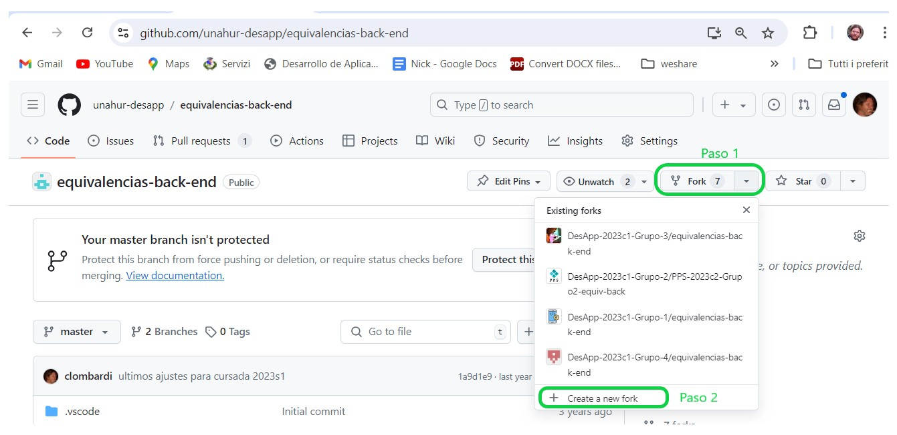
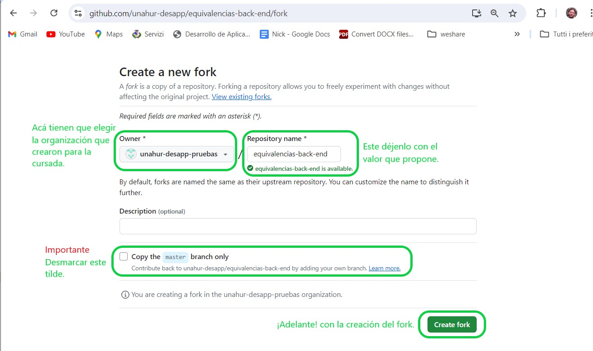
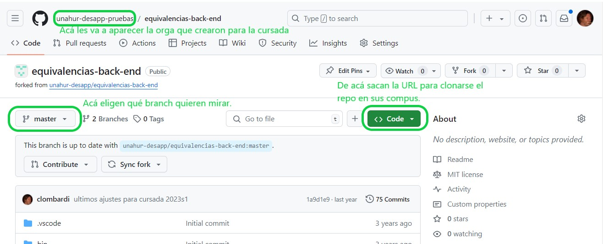
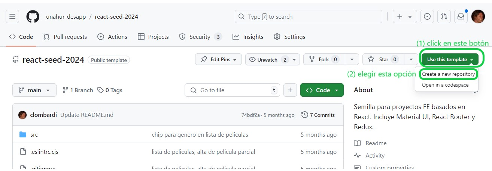
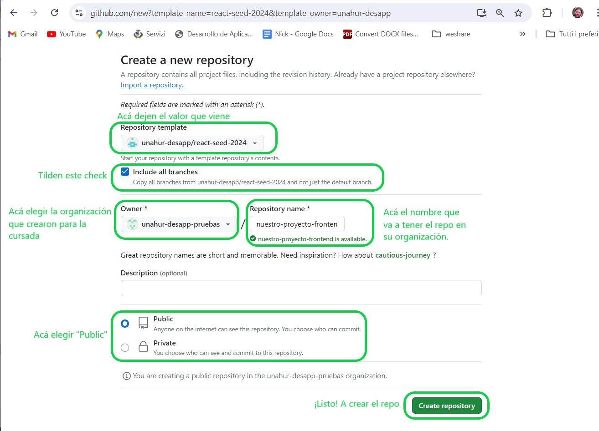
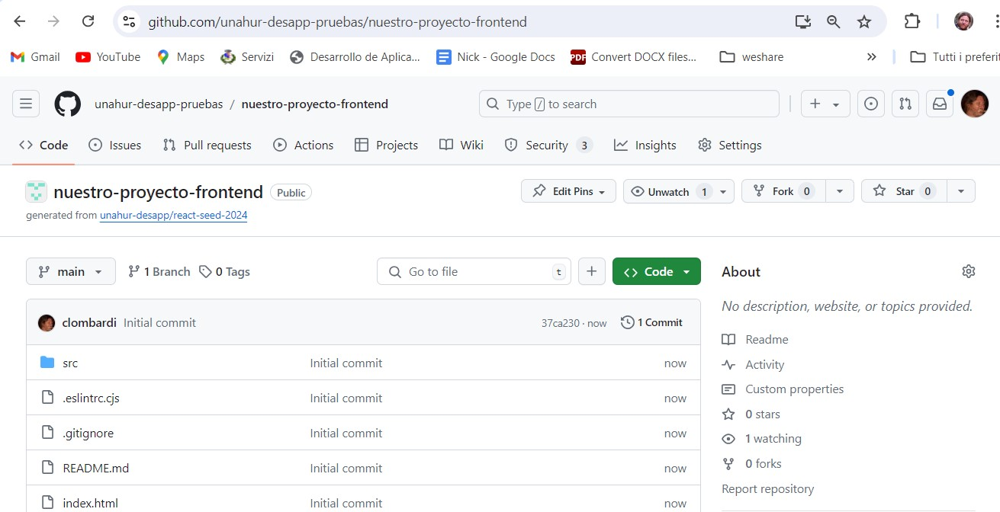

# Creación repositorios de código

Van a tener (al menos) dos repositorios, uno para frontend y otro para backend.
Esos repositorios van a pertenecer a la organización que crearon como parte de las [tareas iniciales](./tareas-iniciales.md).

Cómo crearlos: depende de si son proyectos nuevos o continuación de proyectos que ya existen.

## Continuación de proyectos - fork
Se les van a pasar las URL de los repos de frontend y backend del proyecto al que van a contribuir. Estos repos están en la organización de la materia, que manejamos los docentes.  
El grupo va a crear un _fork_, que es un repo nuevo (que va a estar en la organización del grupo) que queda vinculado al proyecto del cual salió. Eso nos simplifica a los docentes integrar los agregados que haya hecho el grupo, esto lo hacemos después de fin de cuatrimestre.

Cómo se crea un fork: es muy sencillo (posta)

Desde la URL del repo "madre", se hace click en el botón "Fork". Aparece un desplegable, elegir "Create a new fork" abajo de todo.

Les va a aparecer una nueva página. Ahí tienen que hacer tres cosas
- en el combo de "owner", elegir la organización que crearon para la cursada.
- **sacar el tilde** de "Copy the 'master' branch only".
- después de las dos anteriores, darle a "Create fork" abajo a la derecha.

El nombre de repositorio les pedimos que dejen el mismo.

¡Listo! ya tienen el repo en su organización, listo para clonar.

> **Atención**  
> Después de hacerse el clon, fíjense bien _desde qué branch_ tienen que largar. Eso se los vamos a decir los docentes.  
> Es **mucho muy importante** que _inmediatamente después_ de hacer clone, hagan un `git checkout (branch-que-me-dijeron-los-docentes)`. 
> Si no hacen esto, van a arrancar desde un punto de partida equivocado, y después compaginar se puede hacer muy complicado.

## Proyectos nuevos - usar los templates

Si el proyecto que le tocó al grupo es nuevo, es probable que se quieran aprovechar los templates que generamos, que se pueden encontrar en la [página de recursos](./recursos/recursos-index.md).

Lo que van a hacer es crear, para cada template que decidan usar, un repo en su organización que toma la estructura del template. El procedimiento es similar al que contamos arriba para crear un fork, ahí va.

Desde la URL del template, se hace click en el botón "Use this template". Aparece un desplegable, elegir la primera opción que es "Create a new repository".

Va a aparecer una página, acá tienen que:
- Tildar el check "Include all branches".
- Elegir como "owner", la organización que crearon para la cursada; ver [tareas iniciales](./tareas-iniciales.md).
- Definir un nombre para el repo que van a crear. Recomendamos que elijan un nombre para el proyecto, y que los repos se llamen `<mi-proyecto>-backend` y `<mi-proyecto>-frontend`.
- Elegir "Public" en la opción entre "Public" y "Private".
- Darle a "Create repository".
 

¡Listo! tenemos nuestro nuevo repo listo para clonar.

En este caso, cuando clonen solamente van a tener el branch `main`. Este branch es muy raro que lo toquen, ustedes van a trabajar sobre otros branches. Consultar las páginas sobre [Git](./git/git-index.md) y [pull requests](./git/git-pr.md).
