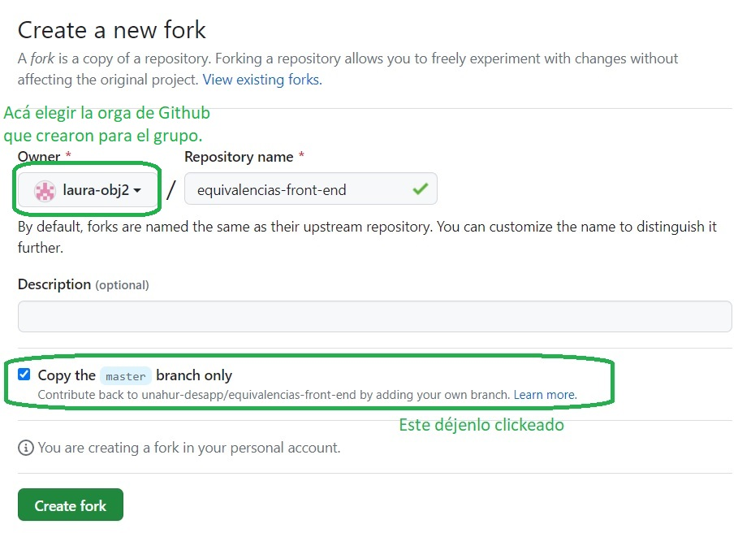

# Primer cuatrimestre de 2023

## Proyectos

Este cuatrimestre vamos a proponer trabajos que consisten en mejoras, correcciones y/o agregados a proyectos que fueron desarrollados en cuatrimestres / años anteriores en este mismo espacio de Desarrollo de Aplicaciones / PPS.

Vamos a tomar dos proyectos: uno busca digitalizar los pedidos de equivalencia que pueden hacer les estudiantes de la UNahur, el otro el manejo del presupuesto asignado a proyectos de investigación.

En total definimos cinco posibles trabajos, tres sobre equivalencias, dos sobre presupuesto de proyectos.

## Cómo arrancar

Antes que nada, hacer lo que se indica en la página de [tareas iniciales](../tareas-iniciales.md).

Una vez hecho esto, crearse **forks** de los repositorios de backend y de frontend del proyecto sobre el que les toque trabajar. Para eso: se loguean con un usuario que esté en la organización de Github del grupo, entran al link del repo, y pulsan el botón de "fork" arriba a la derecha.

.

Va a aparecen una pantalla, similar a cuando crean un repo de cero. En esta pantalla elegir como owner la orga de Github que crearon para el grupo, y dejar checkeado el checkbox de "copiar solamente el branch master".

.

Después se clonan los proyectos, primero les dan `npm install` para cargarse las dependencias, y después miren las instrucciones en los repo base que encuentran en [la página de recursos](../recursos/recursos-index.md). **Atenti** no hace falta clonarse estos, solamente entren en la página del repo y miren las instrucciones.

## Equivalencias

El objetivo de este proyecto es ayudar a la gestión de los pedidos de equivalencia. La aplicación tiene dos roles: estudiante y director de carrera. El estudiante carga uno o varios pedidos de equivalencia, en cada pedido se indica qué materia quiere que le den por aprobada, y qué materias cursó en otras universidades que cubren los contenidos de esa materia. El director evalúa el pedido, y puede: aprobarlo, rechazarlo, o pedirle más información al estudiante.

Este proyecto fue comenzado por un grupo que cursó Desarrollo de Aplicaciones en el [segundo cuatrimestre de 2021](./2021s2.md). Esta es [la carpeta](../adjuntos/equivalencias-2021s2.pdf){:target="_blank"}.

Los repositorios base son: 
- frontend: [https://github.com/unahur-desapp/equivalencias-front-end](https://github.com/unahur-desapp/equivalencias-front-end)
- backend: [https://github.com/unahur-desapp/equivalencias-back-end](https://github.com/unahur-desapp/equivalencias-back-end)

### Extensión 1

Este trabajo consiste en implementar varios agregados:
- CRUD de universidades, incluyendo persistencia en la BD, y usar las carreras registradas en el form de nueva equivalencia.
- Agregar la carga y gestión de un PDF para cada materia aprobada que se incluye en un pedido de equivalencia.
- Agregar validaciones en la carga de equivalencias: el año no puede ser en el futuro, la carga horaria total no puede ser mayor a 999, la nota de aprobación tiene que estar entre 4 y 10, y ser optativa.
- Abrir un popup o cambiar de página cuando el usuario de rol estudiante hace click sobre "Perfil de usuario" en el header.
- Definir un header específico para el rol directivo.
- Mostrar el nombre del usuario cuando se hace mouse over en el circulito a la derecha en el header.
- Implementar la funcionalidad asociada al botón "Registrarse" en la página de login. En un principio, sólo para usuarios de rol estudiante.
- encriptar contraseñas, que hoy están planas en la BD.
- que al estudiante le llegue un mail cuando el director toma alguna acción sobre un trámite de equivalencia.

### Extensión 2

Este trabajo tiene tres partes.

(1)  
Agregar el status en la tabla de trámites de equivalencia para rol directivo. Agregar un filtro que permita ver sólo los trámites pendientes.

(2)  
Revisar el circuito por el cual un estudiante carga una equivalencia y el director la revisa. Arreglar lo que no funcione, excepto validaciones que las hace otro grupo. En particular, que la información que carga el estudiante la vea bien el director.

(3)  
Pasar a un modelo en el cual un mismo trámite de equivalencia puede incluir varias materias solicitadas, en lugar de una sola como ahora.  
En este modelo, el directivo podría aprobar, dentro de un mismo trámite, algunas materias sí y otras no. Los comentarios que sean globales. Un trámite está cerrado cuando hay una decisión para cada una de las materias solicitadas.

### Extensión 3

Este trabajo tiene tres partes.

(1)  
CRUD de carreras de la UNaHur incluyendo persistencia en la BD, y usar las carreras registradas en el form de nueva equivalencia.

(2)  
Asignar a los usuarios de rol directivo una o varias carreras, de modo tal que puedan ver solamente los trámites que corresponden a "sus" carreras.  
Agregar un nuevo rol "superusuario" que sea como un directivo pero pueda ver todos los trámites, y que también pueda acceder a una tabla con todos los usuarios, pudiendo filtrar por rol directivo o estudiante.  

(3)  
Transformar el recuadro de "respuesta" en un chat asociado específicamente al trámite de equivalencia, en el cual tanto los directivos como el estudiante pueden escribir mensajes. Registrar qué usuario ingresó cada mensaje. 

## Presupuestos de subsidios de investigación

El objetivo de este proyecto es asistir a los grupos de investigación que reciben subsidios de la UNaHur en la gestión de los fondos que se les asignan, de modo tal que puedan registrar los gastos realizados y conocer en todo momento el monto disponible; y al personal de la Secretaría de Investigación en el monitoreo del dinero destinado a estos subsidios.

Este proyecto fue comenzado por un grupo que cursó Desarrollo de Aplicaciones en el [segundo cuatrimestre de 2021](./2021s2). Esta es [la carpeta](../adjuntos/presupuestos-subsidios-investigacion-2021s2.pdf){:target="_blank"}.

Los repositorios base son: 
- frontend: [https://github.com/unahur-desapp/control-gastos-subsidios-frontend](https://github.com/unahur-desapp/control-gastos-subsidios-frontend)
- backend: [https://github.com/unahur-desapp/control-gastos-subsidios-backend](https://github.com/unahur-desapp/control-gastos-subsidios-backend)

### Extensión 1

Consiste en completar varias funcionalidades que están a medio hacer en la implementación actual.
- Hacer andar la opción de carga de proveedores (rol investigador).
- Hacer andar la opción de carga de proyectos (rol administrador). En esta opción:
  - el campo de "usuario" tiene que corresponder con el nombre de un usuario rol investigador. Sería ideal que se pudiera vincular con varios usuarios.
  - reemplazar "año" (p.ej 2023) por "convocatoria" (p.ej. UNAHUR 8). Cada proyecto corresponde a una convocatoria.
  - cargar el total por cada rubro.
- En la opción "nueva compra" dentro de compras (rol investigador): mostrar el saldo disponible del rubro en lugar del total, agregar número de factura, permitir el agregado de un nuevo proveedor en conjunto con la carga de la compra.
- En la tabla de "compras" (rol investigador): mostrar fecha, mostrar el número de factura cargado, borrar la columna "número de compra".
- Hacer andar la opción de listado de proyectos (rol admininstrador). Incluir: convocatoria, presupuesto total, gastado, remanente.

### Extensión 2

Este trabajo tiene dos partes.

(1)  
En la navegación del rol investigador, tener en cuenta que el usuario logueado puede tener asociados varios proyectos. En la opción "proyectos", que pueda elegir uno que se setea como "proyecto actual".  
Las opciones de datos generales, presupuesto y compras, incluida la carga de una nueva compra, se vinculan al proyecto elegido como actual. Mientras el usuario no haya elegido un proyecto actual, estas opciones tienen que quedar deshabilitadas.

(2)  
Mejorar vista del presupuesto, y resolver aprobación de gastos por parte de secretaría.  
Cada compra puede ser aprobada o rechazada por la secretaría, o sea por un usuario de rol administrador. 
En el presupuesto tiene que constar para cada rubro: total de gastos aprobados, total de gastos pendientes de verificación, remanente (que es presupuesto - gastos aprobados).

## Grupos

### Grupo 1
Silvana Farías  
Camila Bertolani  
Ezequiel Mondone  
Tomás Miranda   
Pablo Origlia  

**Trabajo elegido**  
Equivalencias - extensión 1

### Grupo 2
Raúl Gutierrez  
Mariano Galván  
Emir Ahumada Challiol  
Javier Robledo  
Julián Páez

**Trabajo elegido**  
Subsidios - extensión 1

### Grupo 3
Leonel Zeballez  
Florencia Dias  
Gonzalo Iglesias  
Jose Ivorra  
Ezequiel David  

**Trabajo elegido**  
Equivalencias - extensión 3

### Grupo 4
Luciano Robles  
Ramiro Ambrosetti  
Fernando Rodriguez  
Nicolas Silberman  
Julián Diani  

**Trabajo elegido**  
Equivalencias - extensión 2

### Grupo 5
Fernando Bouchet  
Marcos Monescao  
Alan Cichello  
Tobías Di Salvo  
Juan Nieva  
Miguel Ángel de Robles  

**Trabajo elegido**  
Subsidios - extensión 2

## Tareas iniciales agregadas

Como este cuatrimestre se pierden dos clases por feriados (6 de abril y 25 de mayo), y (créannos) el tiempo se pasa volando, necesitamos aprovechar lo más que podamos estas primeras dos semanas.

Para eso les pedimos que:
- no más allá del 6 de abril, armen los grupos y hagan un ranking de los tres trabajos que más les interesan, en orden de interés (el que prefieren primero). Esto nos lo mandan por mail a los docentes, los mails los tienen en la [página inicial](../index).
- con eso el 7 de abril definimos y les informamos, de qué trabajo le toca a cada grupo.
- entre ese momento y el 13 de abril: además de las tareas iniciales que se describen [en otra página](../tareas-iniciales). crearse un fork de los repos de frontend y backend del proyecto sobre el que tengan que trabajar, hacerlos andar en la compu local de cada uno.

## Cronograma Desarrollo de Aplicaciones

| Fecha | Es presencial | Actividad |
| --- | --- | --- |
| 30/03 | No | Presentación / selección de trabajos.   Relevamiento / análisis inicial. |
| 06/04 | - | Feriado |
| 13/04 | No | <b>1er Sprint - planning</b>   Figma |
| 20/04 | No | Metodología Agile   Seguimiento |
| 27/04 | No | <b>1er Sprint - review<b> <b>2do Sprint - planning<b> |
| 04/05 | No | React - parte 1. |
| 11/05 | No | Seguimiento |
| 18/05 | No | <b>2do Sprint - review<b> <b>3er Sprint - planning<b> |
| 25/05 | - | Feriado   De ser necesario, se puede hacer un seguimiento extra martes 30 o miércoles 31 |
| 01/06 | No | React - parte 2.   Manejo de branches. |
| 08/06 | No | <b>3er Sprint - review</b> <b>4to Sprint - planning</b>   React - parte 2 |
| 15/06 | No | Seguimiento |
| 22/06 | No | Backend. |
| 29/06 | No | <b>4to Sprint - review<b> <b>5to Sprint - planning<b> |
| 06/07 | Sí | Práctica presentación presencial | 
| 13/07 | No | Seguimiento |
| 20/07 | -- | <b>5to Sprint - review<b> |
| 27/07 | Sí | Presentación presencial |
