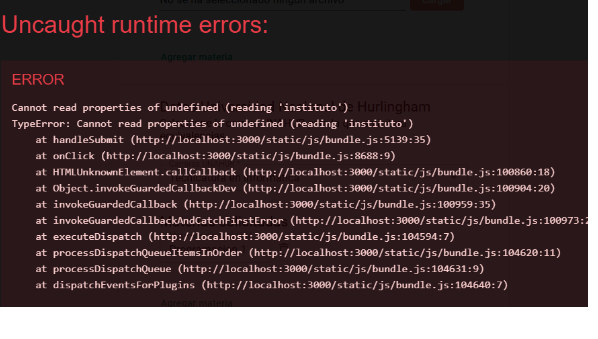

# Pedidos de equivalencias

## Contexto y objetivos
Como sabemos bien, las carreras de Informática tienen una enorme popularidad. Además de una gran alegría, esto trae el desafío de gestionar la gran masa de estudiantes.

Un aspecto que le genera mucho trabajo administrativo a la Universidad es la gestión de las solicitudes de equivalencia.
¿Qué es una solicitud de equivalencia? Un pedido que puede hacer unx estudiante que aprobó materias en otra Universidad, de que se las reconozcan como equivalentes en contenidos con materias del plan de estudios de la carrera que está haciendo en la UNAHUR. Si el pedido es aceptado, entonces al/a la estudiante se le dan por aprobadas las materias UNAHUR que se aceptan como “equivalentes” a las que el/la solicitante aprobó en otro lado.

### Stakeholders
El stakeholder para este proyecto es Fernando Puricelli.

## Estado del proyecto
 En el marco de cursadas anteriores, se llegó a implementar las funcionalidades principales pedidas por Fernando.  
Esta es la [carpeta](../../adjuntos/equivalencias-2023s2.pdf){:target="_blank"} presentada por el grupo que trabajó sobre este proyecto en el segundo cuatrimestre de 2023 y primero de 2024.

## Objetivos preliminares para segundo cuatrimestre 2024 y primer cuatrimestre 2025

El trabajo que se propone incluye tareas de varios tipos.
- Algunas son _técnicas_, esas las establecemos en principio los docentes, vale negociar. 
- Otros son _bugs_, esos hay que arreglarlos.
- Hay un par que se refieren (en principio) a _documentación_, esas hay que hacerlas. Probablemente se descubran bugs, esos hay que arreglarlos.
- Finalmente sugerimos algunos agregados y mejoras relacionados con la _funcionalidad_. Esto hay que consensuarlo y coordinarlo con los stakeholders.

### Tareas técnicas
- Actualizar el stack tecnológico del FE al nuevo template, o sea: vite / react 18 / mui 5 / react router 6.
- Agregar autenticacion por Json Web Token (JWT)
- Configurar un storage en cloud para los archivos adjuntos que tiene que manejar la aplicación (ver si esto ya está previsto en el proyecto que van a recibir).
- Desplegar el producto en algún servicio público, y acompañar a Fernando en la realización de pruebas preliminares de uso. Registrar las modificaciones y agregados que se detecten como necesarios para dejar operativo el producto. En la medida de lo posible, implementar estas modificaciones y agregados, y generar versiones sucesivas del producto.
- Montar la estructura para implementar tests unitarios, e implementar algunos. Idealmente tanto BE como FE.

### Bugs
- Al momento de solicitar una materia da un error de runtime. Se deberia controlar y dar aviso al usuario sobre el faltante de informacion.

Imagen error.  


- Cuando se ingresa con el superusuario tanto en la seccion usuarios como carreras no se muestra la imagen.

Imagen error.  


### Posibles agregados y mejoras funcionales.
- La principal funcionalidad nueva es que se pueda mantener un status de materias con equivalencias que, al menos en principio, la UNAHUR va a aceptar. Esto surge de los trámites ya estudiados y definidos.
Pongamos un ejemplo inventado. Supongamos que una estudiante pide que se le reconozcan Organización de Computadoras y Redes de Computadoras, porque aprobó Arquitectura de Computadoras 1, 2 y 3 en la Universidad de la Gran Montaña, y la UNAHUR, después de analizar el pedido, decide aceptarlo. Unos meses después viene otro estudiante, que aprobó las mismas materias en la Universidad de la Gran Montaña, y también solicita que le reconozcan Organización de Computadoras y Redes de Computadoras. La UNAHUR no va a volver a hacer la evaluación que ya hizo, en principio se puede suponer que la solicitud se va a aceptar.

Lo que se busca con esta funcionalidad es llevar el registro de qué “esquemas de pedidos de equivalencia” ya fueron aceptados.
Esta información tiene que estar disponible para el directivo que esté evaluando la solicitud.
También se desea que elx estudiante que está cargando una solicitud, pueda consultar a partir de las materias que trae aprobadas de otras Universidades, cuáles materias podría pedir y que (en principio) le van a ser reconocidas.

## Instrucciones particulares para arrancar

### Entender el dominio
Leer la carpeta del equipo que trabajó en este proyecto en 2023/2024, que está linkeada arriba en esta página. Entender el dominio y las funcionalidades implementadas.

### Inicializar los repos de código remoto y local
Hacer los fork (ver instrucciones [en esta página](../../creacion-repos-de-codigo.md)) de los repositorios con el código existente, en la organización de GitHub correspondiente al grupo. Los repositorios base que deben forkear son estos:
- Backend: https://github.com/unahur-desapp/equivalencias-back-end 
- Frontend: https://github.com/unahur-desapp/equivalencias-front-end

Una vez creados los fork, en el equipo de cada integrante:
- Clonar los dos repos apenas creados (o sea los forks).
- **Importante** <br/> Para los dos repositorios, moverse al branch `inicio-c2-2024`.
- En ambos repos, ejecutar `npm install` para cargar las librerías.
- En el readme de cada proyecto se encuentran algunas librerias complementarias que tambien deben ser instaladas 

### Configurar la BD
- Instalarse PostgreSQL.
- Crear el usuario para acceder a la base de datos
- Crear la base de datos equivalencias
- Editar las variables de entornos en el archivo `.env.development`
- Ejecutar las migraciones iniciales `npm run db:init`
- Cargar datos de prueba `npm run db:seed`


Los usuarios y claves se encuentran en el readme del FE.

```
    DNI      PASS    USUARIO    ROL
30563652    prueba    Enzo     alumno
20569859    12345    Anthony   directivo
26777239    unahur    Super    superusuario

```

### Levantar BE y FE
Para el BE.
- Copiamos las variables de entorno para conectarnos a la base de datos `cp .env.development .env`
- Corremos el proyecto con `npm start`  

Para el FE, se debe setear las variables de entorno `REACT_APP_API_URL` con la URL donde levantó el BE (que por defecto es `http://localhost:3001`).
- Esto lo realizamos con el comando `cp .env.example .env`
- Una vez hecho esto, darle nomás a  `npm start`.

### Después
Una vez BE y FE levantados, navegar el FE para entender un poco de qué se trata, relacionar con lo que se leyó en la carpeta. 
Se recomienda hacer lo siguiente:
- Entrando como alumno crear la solicitud de equivalencia para una materia.
- Entrar con el usuario de perfil directivo, comenzar un chat con el alumno sobre la equivalencia solicitada. Por ultimo aprobar o desaprobar la solicitud
- Entrar con el usuario de perfil superusuario, dar de alta instituciones.

Revisar la lista preliminar de objetivos, entender cada ítem.


## Un poco más adelante
Cuando se conzca el proyecto se puede solicitar una reunion con Fernando Puricelli para ofrecerle una propuesta en la nueva funcionalidad solicitada.


