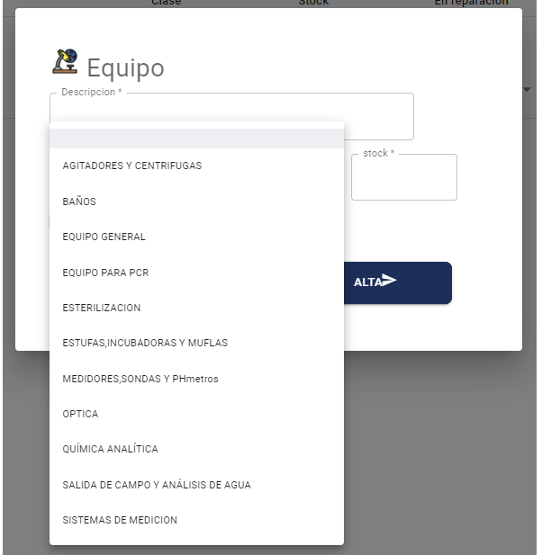
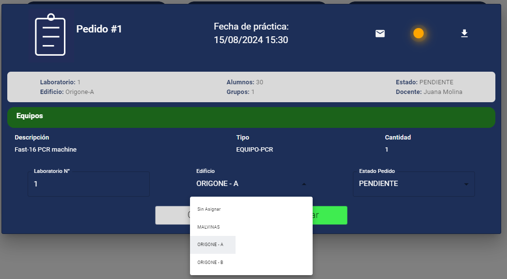

# Pedidos de materiales

## Contexto y objetivos
En varias materias de las carreras del instituto de Biotecnología (y tal vez también Salud) se hacen clases prácticas en laboratorios, en las cuales lxs estudiantes tienen hacer experimentos. 
Para estos experimentos, la Universidad provee: 
- _equipos_, p.ej. un aparato que rota tubos de ensayo a gran velocidad para producir cierto efecto en la muestra que se les pone.
- _materiales_, p.ej. los tubos de vidrio.
- _reactivos_, que son sustancias que se usan para producir los efectos que se miden en el experimento.

Los docentes realizan pedidos de reserva de laboratorio, en los que indican qué equipos, materiales y reactivos se necesitan, y en qué cantidades. Con esta información, el personal de **laboratorio** designa en cuál de los laboratorios de docencia de la UNAHUR se desarrolla la clase, y organiza la provisión de los elementos necesarios.

El equpo que gestiona los laboratorios solicitó hace ya un tiempo, una aplicación que permita gestionar estos pedidos de materiales, en lugar de las idas y vueltas de mails con los docentes más anotaciones en algún Excel u hoja para registrar las reservas.

### Stakeholders
Los stakeholders para este proyecto son Paloma Martínez Ponce y Marco Ruiz.

## Estado del proyecto
En cursadas anteriores se avanzó mucho con este proyecto, interactuando activamente con personal de laboratorio, y llegando a una versión que tal vez esté bastante cerca de quedar operativa.  
Esta es la [carpeta](../../adjuntos/pedidos-de-materiales-2024s1.pdf){:target="_blank"} presentada por el grupo que trabajó sobre este proyecto en el segundo cuatrimestre de 2023 y primero de 2024.

## Objetivos preliminares para segundo cuatrimestre 2024 y primer cuatrimestre 2025

El trabajo que se propone incluye tareas de varios tipos.
- Algunas son _técnicas_, esas las establecemos en principio los docentes, vale negociar. 
- Otros son _bugs_, esos hay que arreglarlos.
- Hay un par que se refieren (en principio) a _documentación_, esas hay que hacerlas. Probablemente se descubran bugs, esos hay que arreglarlos.
- Finalmente sugerimos algunos agregados y mejoras relacionados con la _funcionalidad_. Esto hay que consensuarlo y coordinarlo con los stakeholders.

### Tareas técnicas
- Modificar las URL de las rutas de BE para acercarlas un poco a las ideas de API REST.
- Ver qué uso se hace de los tokens JWT, por lo que se ve (en `VerifyToken.js`) parece que solamente se valida que sea un token válido. Se puede aprovechar para informar al FE de usuario y rol, para controlar las acciones que puede realizar cada rol (p.ej. un docente no puede cargar un nuevo equipo).
- En el FE, migrar de React Scripts a Vite (lo que se usa en el template de FE, ver [la página de recursos](../../recursos/recursos-index.md)).
- En el FE, hay un componente que se llama PedidosV1, y una ruta que lleva a este componente. Si la ruta no se usa, volarla. Si una vez que se voló la ruta el componente no lo usa nadie, volarlo. Si se usa, entender de qué se trata, y ponerle un nombre que se entienda mejor.
- Los equipos y materiales están clasificados en distintas categorías, en la UI se las llama "clases" (ver imagen abajo). Ahora los tipos están harcodeados en el código del FE. Sacarlos de ahí, en dos pasos:
  - Pasarlos a una colección de configuración en la base Mongo, crear un endpoint de BE que los exhiba, llamar a ese endpoint desde el FE para configurar los select.
  - Permitir que se puedan cambiar estas categorías desde el FE, solamente para el rol administrador.
- Lo mismo para los edificios (ver imagen abajo).

Imagen de las "clases" de materiales o equipos, esto es el alta de material (perfil laboratorio o administrador).  


Imagen de los edificios, esto es la edición de un pedido (perfil laboratorio).  


### Bugs
- Revisar el tab inicial en la edición de un pedido, en particular la carga de fecha y hora. Lograr que ande y que se entienda. Revisar también las validaciones.
- Revisar el layout de la página principal rol docente, en particular el botón para agregar un pedido.
- Si en el filtro de pedidos quiero cargar la "fecha desde" tipeando con el teclado (o sea, no eligiendo desde el calendario), salta un error.
- Si en la lista de pedidos no hay pedidos que mostrar, desplegar un mensaje "No hay pedidos para mostrar" en lugar de la ruedita que aparece ahora.

### Documentación
- Entender y documentar el manejo de stock, esto impacta en el código de FE y BE. Relacionado con esto, para qué sirve el atributo enUso en equipos, materiales y reactivos. Revisar que funcione como se espera. Verificar la aparición del mensaje "Consultar stock". Vale proponer simplificaciones. Si hay bugs, agregarlos a la lista de arriba.
- Relacionado con lo anterior, verificar qué pasa con la indicación "en uso" si en la creación de un pedido (rol docente) se cambia la fecha.

### Posibles agregados y mejoras funcionales.
- Embellecer y completar el PDF asociado a un pedido. En particular, agregar equipos / materiales / reactivos involucrados. 
- Que los docentes se puedan bajar el PDF asociado a un pedido que hicieron.
- Que sea el docente sea la gente de laboratorio, pueda modificar los materiales, reactivos y/o equipos de un pedido, mientras esté pendiente.
- Agregar un listado de "movimientos" de un equipo / material / reactivo, o sea los pedidos donde se incluyó, con docente, fecha y cantidad.
- Agregar control de no superposición en el uso de un laboratorio, o sea, si el personal asigna el labo X a un pedido que es para (ponele) el 18 de octubre de 16 a 18, que no haya otro pedido asignado al mismo laboratorio para el mismo día en ese rango de horas. Sobre esto hay variantes que podrían ser útiles, esto hay que consultarlo con los stakeholders.
  - Que dos o más pedidos puedan compartir un laboratorio, si el total de alumnos no supera lo que se banca el laboratorio (para esto hay que registrar cuántos alumnos entran en cada laboratorio).
  - Contemplar un tiempo entre pedido y pedido, que sería lo que lleva limpiar y preparar la nueva actividad. P.ej. si hay una actividad de 16 a 18, que se bloquee desde las 15.30 hasta las 18.30 (media hora ante sy después).
- Mostrar el calendario de uso de un laboratorio, de acuerdo a los pedidos cargados.
- Mejorar el manejo de stock, permitiendo cargar operaciones de compra de equipos / materiales / reactivos.
- Agregar filtro de docente (que hizo el pedido) para filtrar pedidos.


## Instrucciones particulares para arrancar

### Entender el dominio
Leer la carpeta del equipo que trabajó en este proyecto en 2023, que está linkeada arriba en esta página. Entender el dominio y las funcionalidades implementadas.

### Inicializar los repos de código remoto y local
Hacer los fork (ver instrucciones [en esta página](../../creacion-repos-de-codigo.md)) de los repositorios con el código existente. Los repositorios base que deben forkear son estos:
- Backend: https://github.com/unahur-desapp/pedidos-materiales-de-laboratorio-backend 
- Frontend: https://github.com/unahur-desapp/pedidos-materiales-de-laboratorio-frontend

Una vez creados los fork, clonarlos en los equipos de cada integrante, y ejecutar `npm install` en ambos, para cargar las librerías.

### Configurar la BD
Instalarse MongoDB, o usar Atlas (el servicio cloud gratuito de Mongo). Configurar el acceso a la BD desde el proyecto de backend, seteando la variable de ambiente `URI_MONGO` en el archivo `.env` en el proyecto de backend.

Agregar un documento en la colección de usuarios, con estas características (salvo `contrasenia`, `admin`, `editor`, `rol` y `__v`, en los otros atributos pueden poner el valor que quieran. Incluso no es necesario que el id de usuario sea `admin`, aunque esto se recomienda).  
**¡¡Atención!!** - fíjense que dni y matricula son _números_, eso tiene que ser así.
```
{
    _id: ObjectId("66b4fd973c67f8681c1b01fe"),
    usuario: 'admin',
    contrasenia: '$2b$10$TrsBSx5JPJx8U9gQazlrF.4JMKEQ6dglANaWIUU3U8Wq2mkP6xdG6',
    nombre: 'Aymará',
    apellido: 'Rocamora',
    dni: 88778877,
    matricula: 333444,
    admin: true,
    email: 'aymara.rocamora@notamail.com',
    editor: false,
    __v: 0,
    rol: 'lab'
}
```
La clave de este usuario es 123123. Esto está contado en la carpeta del equipo que trabajó en este proyecto en 2023.

### Levantar BE y FE
Para el BE, simplemente `npm start`.  

Para el FE, setear las variables de entorno `REACT_APP_API_URL` con la URL donde levantó el BE (que por defecto es `http://localhost:3001`) y `REACT_APP_USER` con un nombre cualquiera, pero tiene que estar.  
Una vez hecho esto, darle nomás a  `npm start`.

### Después
Una vez BE y FE levantados, navegar el FE para entender un poco de qué se trata, relacionar con lo que se leyó en la carpeta. 
Se recomienda hacer lo siguiente:
- Entrando como el admin que crearon, cargar al menos: una usuario de perfil laboratorio, un usuario de perfil docente, un equipo, un material y un reactivo. <br/> Anotar las contraseñas de los usuarios que creen, en la base están encriptados.
- Entrar con el usuario de perfil docente, cargar un pedido.
- Entrar con el usuario de perfil laboratorio, ver el pedido.

Revisar la lista preliminar de objetivos, entender cada ítem.


## Un poco más adelante
Cuando se sientan seguros con la aplicación y el dominio, solicitar una reunión con los stakeholders, mostrarle lo que está hecho, plantearle los agregados planteados por los docentes relacionados con la funcionalidad, y refinar los pasos a seguir.


