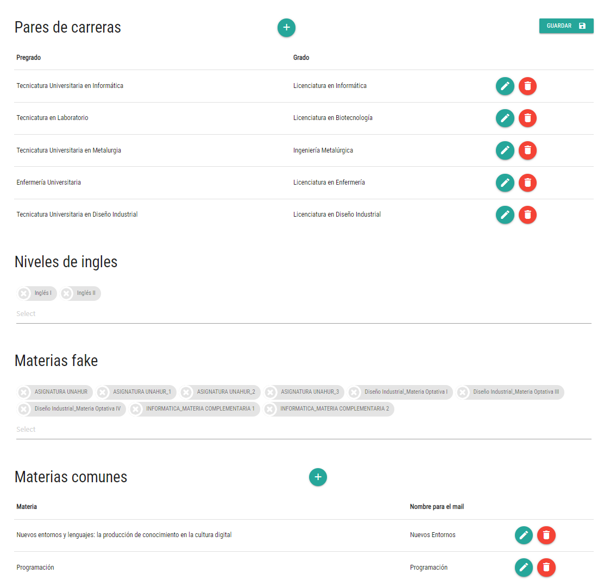
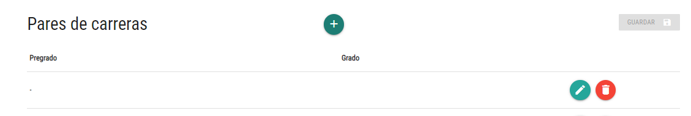
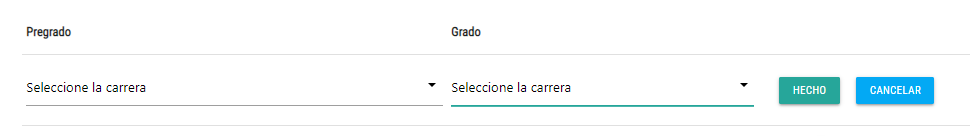

# Sugerencias de cursada y acompañamiento académico

## Contexto y objetivos
Desde la comunidad de Informática se desarrolló una aplicación que genera y envía en forma masiva mails con sugerencias de cursada y otras acciones, donde el contenido está personalizado para cada estudiante a partir de los datos de su trayectoria académica.

El objetivo en el cual se inscribe este proyecto es realizar una nueva implementación de esta aplicación, tomando como base este stack tecnológico:
- Para el FE: React 18, Material UI 5, React Router 6, y Vite (en lugar de Create React App). Estas son las herramientas de base del nuevo template de FE.
- Para el BE: Express o Nest.js, y Mongoose. 
- BD: Mongo.

> **Atención**  
> Dado que el proyecto consiste en la migración de una aplicación que está operativa, hay que respetar las estructuras de BD existentes. Se pueden proponer cambios pero:  
> 1. Tienen que estar *muy* bien justificados.
> 2. Hay que consensuarlos con el stakeholder antes de aplicarlos.
<hr/>

### Stakeholder
El stakeholder para este proyecto es Carlos Lombardi.


## Estado del proyecto
En el primer cuatrimestre de 2024, un grupo de Desarrollo de Aplicaciones comenzó con el desarrollo, implementando exitosamente la edición de varios elementos de configuración. Para el BE, este grupo eligió Express y JavaScript como lenguaje de programación.


## Objetivos preliminares para segundo cuatrimestre 2024 y primer cuatrimestre 2025
Planteamos tareas técnicas, un par de bugs, y varias tareas que agregan o mejoran funcionalidades.  
Las tareas técnicas se consensúan con los docentes, los bugs se arreglan y ya, las cuestiones funcionales se consensúan con el stakeholder.

### Tareas técnicas
- A elección del grupo, migrar el BE a Nest.js sobre TypeScript; sería una buena oportunidad para aprender un lenguaje nuevo.
- Tomar los nombres de carreras y materias, que no están en la base propia, mediante consultas a otro servicio de BE, del cual el stakeholder les va a proporcionar un mock, espera poder tenerlo listo entre el 5 y el 10 de septiembre. 
- Modificar las URL de los endpoints definidos en el BE para que estén un poco más alineados con la idea de API REST.  
P.ej. que `GET /api/carreras` traiga todas las carreras, `GET /api/carreras/:id` traiga una sola por id.
- Agregar algo de test unitario, al menos en backend.
 
### Bugs
- En la edición de condiciones para una carrera, si agrego una y después quiero agregar una segunda, se ve la configuración de la condición que se agregó antes. Debería no verse ninguna configuración, igual que cuando se cargó la primer condición.

### Funcionalidades a agregar/mejorar/modificar
- Agregar la configuración de datos generales; ver imágenes abajo.
- Permitir agregar la configuración de una carrera que está entre las que devuelve el servicio de datos de Guaraní, pero que todavía no tiene configuración en la aplicación.
- Permitir agregar la configuración de una materia que está entre las que devuelve el servicio de datos de Guaraní para la carrera que estoy editando, pero que todavía no tiene configuración en la aplicación.
- Modificar la configuración de carreras para que se configuren por separado los distintos planes de estudio que tiene una carrera.
- Pedir confirmación en los borrados.
- Implementar la edición de condiciones en la gestión de párrafos. Hoy la configuración se ve pero no se puede modificar. Hablar con el stakeholder sobre las condiciones posibles, su interacción (no vale "todas con todas"), y la configuración de cada una.
- Implementar alguna forma de typeahead (un select con un input, a medida que tipeo va filtrando entre las opciones del select) para los select de materia y carrera.
- Evaluar qué validaciones tendrían sentido en los forms, y aplicarlas.


Esta es la configuración de datos generales.


Esto pasa cuando se pulsa "+" en la parte de pares de carreras, se abre un nuevo par vacío, que después hay que cargar. El botón "Guardar" está deshabilitado hasta que se carguen las dos carreras.


Cuando se pulsa el lapicito, se ve así. Los combos permiten elegir cualquier carrera, la lista de carreras se traen del servicio de datos de Guaraní.



## Instrucciones particulares para arrancar

### Inicializar los repos de código remoto y local
Hacer los fork (ver instrucciones [en esta página](../../creacion-repos-de-codigo.md)) de los repositorios con el código existente, en la organización de GitHub correspondiente al grupo. Los repositorios base que deben forkear son estos:
- Backend: https://github.com/unahur-desapp/cidia-retencion-backend 
- Frontend: https://github.com/unahur-desapp/cidia-retencion-frontend

Una vez creados los fork, en el equipo de cada integrante:
- Clonar los dos repos apenas creados (o sea los forks).
- **Importante** <br/> Para los dos repositorios, moverse al branch `inicio-c2-2024`.
- En ambos repos, ejecutar `npm install` para cargar las librerías.

### Configurar la BD 
Instalarse MongoDB, o usar Atlas (el servicio cloud gratuito de Mongo). Configurar el acceso a la BD desde el proyecto de backend, seteando la variable de ambiente `MONGO_DB_URL` en el archivo `.env` (o `.env.development`) en el proyecto de backend.  
Si no se encuentra ni `.env` ni `.env.development`, crear el segundo, tal vez encuentren un `.env.example` para copiar.

Después, cargar los datos iniciales, usando los scripts que están [en una página separada](./sugerencias-de-cursadas-datos-iniciales.md).  

> **OJO**  
> estas instrucciones las probé en la consola `mongosh`, que se puede bajar del sitio de Mongo e instalar como un producto separado.  
> Por lo que veo, desde la consola de Atlas sólo se pueden cargar documentos de a uno. Como alternativa a `mongosh` me instalé Compass, ahí tuve que crear las colecciones, pero después con el botón de "Add data" pude cargar varios documentos al mismo tiempo.


### Levantar BE y FE
BE: lanzar `npm start`.  
FE: lanzar `npm run dev`.

No hace falta autenticación para entrar. La URL es `http://localhost:5173`.


### Después
Navegar las funcionalidades implementadas.

Conversar con los docentes sobre la lista provisional de tareas que aparece más arriba.


## Un poco más adelante
Cuando se sientan seguros con la aplicación y el dominio, solicitar una reunión con el stakeholder y refinar los pasos a seguir.


## Más info técnica

### Colecciones en la BD

#### CareerData
Configuración general de cada carrera, un documento por carrera. Matchea con data que viene de SIU Guaraní con este join: `careerId` en CareerData = `id` en el resultado de la consulta a Guaraní.

#### GeneralAcademicData
Algunos datos genéricos de configuración. Esta colección tiene un único documento.

#### RegistrationSuggestionCondition
Especificación de las posibles condiciones para incluir una materia en el mail de sugerencia. Hay un documento para cada tipo de condición. La especificación incluye qué datos hay que pedir para una condición del tipo que se especifica. 

P.ej. este es un documento:
```
{
  codigo: "ANIOS-COMPLETOS",
  descripcion: "Hay que tener regularizadas todas las materias hasta un año, salvo una determinada cantidad",
  parametros: [
    { nombre: "anio", tipo: "Number", descripcion: "hasta qué año debe tener completo el estudiante" }
    ,
    { nombre: "salvo_cantidad", tipo: "Number", descripcion: "hasta cuántas materias pueden faltar" }
  ]
}
```

Acá se especifica que hay un tipo de condición que se llama ANIOS-COMPLETOS, y que para este tipo de condición hay que pedir dos números, anio y salvo_cantidad.

En la app que estamos migrando, esta colección solamente se lee, no existe la posibilidad de especificar nuevos tipos de condiciones o modificar/eliminar los existentes.


#### RegistrationSuggestionConditionUse
Configuración de las condiciones que define cada director de carrera. Hay un documento para cada condición.
P.ej. este es un documento de la base inicial.
```
    {
        id_carrera: 13,
        anio: 4,
        codigo_condicion: 'ANIOS-COMPLETOS',
        config_condicion: { anio: 3, salvo_cantidad: 3 }
    },
```
Esto quiere decir que para la carrera 13 (que es la Lic. en Biotecnología) hay configurada una condición que dice que para ofrecer cualquier materia de 4to año (anio: 4), se tiene que cumplir la condición ANIOS-COMPLETOS con la configuración { anio: 3, salvo_cantidad: 3 } (ver arriba que anio y salvo_cantidad son los parámetros de configuración de ANIOS-COMPLETOS).

#### SubjectData
Datos de cada materia, un documento por materia + carrera (o sea, si una misma materia sirve para muchas carreras, entonces va a haber un documento para cada carrera todos con el mismo id de materia). Sirve para incluir la info que no está en la BD de SIU Guaraní: año y campo curricular de cada materia.  
Matchea con data que viene de SIU Guaraní con este join: `id_materia` en SubjectData = `id` en el resultado de la consulta a Guaraní.  
El `id_carrera` a su vez, matchea con el id de la consulta sobre carreras a SIU Guaraní.

#### SuggestionTextConditions
Nombres de las condiciones que pueden asignarse a un párrafo en la edición de textos. Solamente el nombre. Tiene un documento para cada condición.  
Está la idea de agregar la especificación de qué datos pedir como se hizo con las condiciones para sugerir una materia, pero quedó sin hacer, este sería un lindo agregado.

#### SuggestionTextTemplate
Especificación de los párrafos del mail, incluyendo el texto y las condiciones. Todos los párrafos del mail van en un único documento, ver sección “Configuración - texto” abajo, en particular la parte “De dónde se saca / dónde se guarda esto”. 
