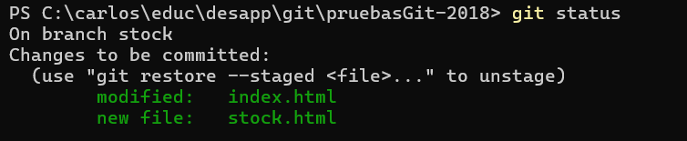

# Git

Juntamos en esta página/sección el material relacionado con Git.

## Las recetas para manejarnos en el trabajo en grupo
Dejamos acá escritas las "recetas" que recomendamos para el trabajo diario con repositorios de Git compartidos.

### Para empezar a trabajar en un repo remoto
```
git clone <URL-del-repo>
```
Esto crea un repo local que está vinculado al repo remoto. Por lo tanto, los cambios que haga
- primero los tengo que registrar en mi repo local, para eso uso `git commit`.
- después tengo que replicar en el repo remoto los cambios que registré en mi repo local, para eso uso `git push`.

Para verificar que mi repo local está vinculado a un repo remoto, puedo escribir `git remote -v`. Me va a mostrar también la URL del repo remoto, que salvo en casos muy especiales se llama siempre `origin`.


Una vez que tengo el clon, me "muevo" al branch `dev` haciendo
```
git checkout dev
```

**Atención**  
Por omisión, el `git clone` va a crear una subcarpeta dentro de la carpeta actual del sistema operativo. El nombre de la nueva subcarpeta es el último segmento de la URL del repo que se está clonando.
P.ej. si ejecuto
```
git clone https://github.com/unahur-desapp/super_proyecto.git
```
esto va a crear una subcarpeta `super_proyecto` dentro de la carpeta desde la cual se lanza el `git`. Esta va a ser la raíz del proyecto.

Para evitar la subcarpeta, y que el clone arranque de la carpeta donde estoy parado (que previamente hay que limpiar) se puede ejecutar de esta forma
```
git clone https://github.com/unahur-desapp/super_proyecto.git .
```
(la única diferencia es el punto del final).

Si el clon se hace de esta forma, la carpeta raíz del proyecto será aquella desde donde se ejecutó el clon. 

Ejemplo: me paro en una carpeta `/project`, hago `git clone https://github.com/unahur-desapp/super_proyecto.git` (sin el punto). Esto va a crear una subcarpeta `/project/super_proyecto`, esta subcarpeta es la raíz del proyecto.

Si hago en cambio `git clone https://github.com/unahur-desapp/super_proyecto.git .`, el clon se va a hacer sobre `/project`, y esta va a ser la raíz del proyecto.


> **Importante**  
> Siempre conviene lanzar los comandos de `git` desde la raíz de mi repo local.


### Cuando empiezo una tarea
- `git checkout dev`
- `git pull`
- `git checkout -b <branch-de-mi-tarea>`
- `git push -u origin <branch-de-mi-tarea>`

El último paso (o sea el `push -u`) es necesario para que el branch que acabo de crear en mi repo local, se vincule con el branch del mismo nombre en el repo remoto. Hasta donde yo sé, no hay forma de decirle a Git que haga este enganche repo local - repo remoto en forma automática para cada branch que creo.


### Trabajo diario
**Cuando arranco**
- `git checkout dev`
- `git pull`
- `git checkout <branch-de-mi-tarea>`  
  
Con esto mantengo actualizado el branch `dev` en mi repo local, incorporando los cambios que mis compañeres hubieran podido integrar.

**Mientras trabajo**  
`git commit`  
a cada rato. 

Recuerden que antes de cada commit tienen que configurar cuáles de los cambios que hicieron van a incluirse en el nuevo commit.

Si _solamente_ hago modificaciones, o sea, ni agrego ni borro ni muevo archivos, entonces alcanza con `git commit -a`, el `-a` significa "todas las modificaciones a archivos que el repo ya maneja".  
Para los archivos que haya agregado, borrado o movido, tengo que hacer `git add` sí o sí, para que "entren" en el siguiente commit.

Si estoy seguro de que todos los cambios que hice van al commit, se puede hacer `git add .`.

Para ver qué cambios tengo que no están en el repo local, puedo hacer `git status`.


Después de hacer `git add` de todos los cambios, si vuelvo a hacer `git status` me va a mostrar que los cambios están "staged", o sea, que van a incorporarse si hago `git commit`.

(notar la diferencia entre "Changes not staged for commit" arriba, y "Changes to be commited" abajo).

Después del `git commit`, veamos qué me dice `git status`

Veo que el branch en mi repo local quedó "adelantado" respecto del remoto `origin/stock`, y que no tengo nada para "subir" al repo local.


**Antes de salir de la compu**  
`git push`  
No le cambio el código a nadie a nadie porque pusheo en mi branch.  
Además, si por cualquier razón se rompe mi repo local, siempre está el respaldo en el repo remoto.


### Cuando termino una tarea - desde la consola
Lo más habitual es usar `merge`. Para esto la secuencia es:
- `git checkout dev`
- `git pull`
- `git merge <branch-de-mi-tarea>`
- ... pruebo que sigue andando ...
- `git push`

Una alternativa es usar  `rebase`, es así:
- `git checkout dev`
- `git pull`
- `git checkout <branch-de-mi-tarea>`
- `git rebase dev`
- ... pruebo que sigue andando ...
- `git push -f`
- `git checkout dev`
- `git merge <branch-de-mi-tarea>`
- `git push`


### Cuando termino una tarea - usando Pull Request
Esta es en rigor la forma que se usa en el 99.5% (y tal vez me quedo corto) de los laburos.  
Como la descripción es un poco larga, la muevo a una [página aparte](./git-pr.md). 


## OK, pero ¿qué es esto de los branches?
Dicho en una forma muy simplificada, cada branch es una "versión" del código de tu proyecto. Al cambiar de branch (eso es lo que hace el `get checkout <branch>`) me estoy cambiando de versión.

Para qué usamos esto: para que cada integrante pueda estar trabajando en lo suyo, sin afectar el trabajo de los demás.

Pero obviamente, en algún momento tenemos que juntar lo que hizo cada uno, porque al final el proyecto es uno solo. 
Por eso tenemos
- un branch para cada tarea, así podemos trabajar aislados.
- un branch de integración (que por lo general se llama `dev` o `develop`), donde movemos el código asociado a cada tarea cuando la terminamos.

Es lo que está sugerido arriba
- cuando empiezo una tarea, creo un nuevo branch a partir del estado de `dev` en ese momento.
- trabajo sobre el branch de la tarea, hago todos los `commit` y `push` que necesito.
- al final, vuelco las modificaciones hechas en el branch de la tarea sobre `dev`. Eso es el `merge`, que se puede hacer desde consola (con la variante del `rebase`) o desde la UI mediante un _Pull request_.


## Material para leer
Dentro de la documentación/material educativo sobre Git, lo que me parece más claro es la [serie de tutoriales de Atlassian](https://www.atlassian.com/es/git/tutorials).  
De tierno que soy se los dejo en castellano.

También les dejo acá algo que escribí en otro contexto, y tal vez les sirva. Son varias páginas.

**OJO** - no arranca de cero, el material que sigue asume que ya lo básico lo tenés.

[Git - intro](../recursos/git/git-intro)

[Los 'lugares' de Git](../recursos/git/git-espacios)

[Un repo es una red de commits](../recursos/git/git-commits)

["Deshaciendo" o "modificando" cambios - reset, commit --amend, revert](../recursos/git/git-reset)

[Repositorios remotos](../recursos/git/git-remote)

[Sincronización de branches - merge y rebase](../recursos/git/git-synchro-merge-rebase)

[Pull requests](../recursos/git/pull-requests)

[Modelos de branches](../recursos/git/branch-models)

[Git - algunos extras](../recursos/git/git-extras)


