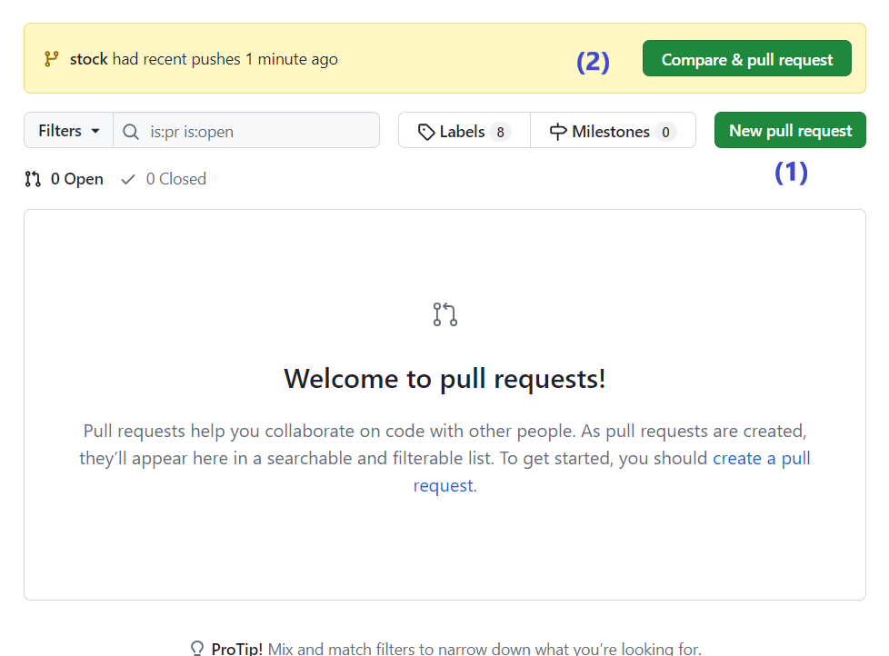

# Git - pull requests
Los pull requests (para los amigos PR) son una forma de poder revisar los cambios que voy a integrar a `dev` desde un branch sobre el que trabajó una persona (o eventualmente varias). 
De esta forma hacemos la integración en forma un poco más tranquila y controlada.  

Los PR son la forma standard de integrar cambios en un branch de integración (`dev` en este ejemplo) para trabajo en grupo.

Veamos cómo se trabaja.

> **Nota**  
> Lo que vamos a describir acá es muy-súper-básico, los PR también son un mundo.  
> Como de lo que más habla la Internet es de la Internet, seguro van a encontrar un montón de referencias.

## Para crear un PR
Después de hacer el último `push` en mi branch, me voy a la interfaz Web de GitHub (o BitBucket o GitLab), y creo un **Pull Request**, desde mi branch hacia `dev`.

Para eso alcanza con pararme en el repo, y elegir "Pull requests" en la barra superior

Va a aparecer una pantalla como esta

Para empezar la creación de un PR, pulsen el botón "New pull request" (1). Si hicieron el último push hace poco, también les va a aparecer la barra (2), también pueden usar el botón que está ahí.

Si van por (1), les va a aparecer algo así

acá tienen que elegir los branches destino y origen, creo que la flechita es bastante clara.

Cuando los elijo, la pantalla pasa a esto

Fíjense que pueden ver el detalle de lo que cambiaron. La verdad que es muy cómoda la interfaz de pull request.

Le damos a "Create pull request" (arriba a la izquierda) y ya estamos más cerca.

Si scrollean, van a ver los cambios igual que antes.

Escribimos una descripción y le damos de nuevo a "Create pull request". 
¡Listo! tenemos el PR (abreviatura súper usada para "Pull Request") creado.

## Para ver aprobar un PR
Si ahora vuelvo a clickear "Pull requests" en la barra superior, me aparece la lista de PRs abiertos.

También van a ver el numerito (1) al lado de "Pull requests", eso indica la cantidad de PRs abiertos.

Entro al PR, veo la misma página de cuando se creó

Miren en particular las solapas recuadradas. Eligiendo "Files changed" van al detalle de los cambios 

(análogamente, si van a "Commits" ven los cambios separados por cada commit).

Volviendo a "Conversation", con el botón de "Merge pull request" integran nomás los cambios sobre `dev`.  
Los branches destino y origin aparecen arriba, justo abajo del nombre del PR.

> **Atención**  
> Acá estamos trabajando directamente con el repo remoto. Si después de mergear quiero ver cómo quedó `dev` en mi compu, tengo que hacer primero `git checkout dev` y después `git pull`, para que me traiga a la compu los cambios que hice sobre el repo remoto.

## Un chiche: comentarios
Vale absolutamente (de hecho es habitual en entornos laborales) hacer revisión cruzada de los PR (yo reviso los que creaste vos, vos revisás los que creé yo), para que los haya visto alguien más antes de integrar.

Si yo estoy viendo un PR que hizo unx compañere (o incluso yo mismo), puedo ponerle comentarios sobre el código, en la vista de "Files changed" (también en la de "Commits").
Para eso me paro justo a la derecha del número de línea y me aparece el "+"

lo pulso y acá estamos

Para hacerla sencilla, vamos por "Add single comment"

Así podemos hacer debates sobre el mismo PR.

Los comentarios no resueltos (o sea, hasta que se pulsa en "Resolve conversation") quedan también en la solapa de "Conversation" del PR.

Bueno, hasta acá les contamos, ahora les toca a ustedes seguir mirando.

