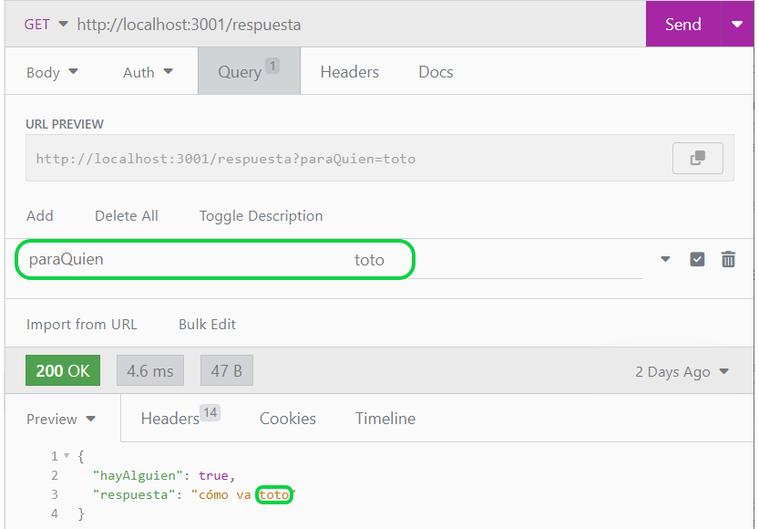
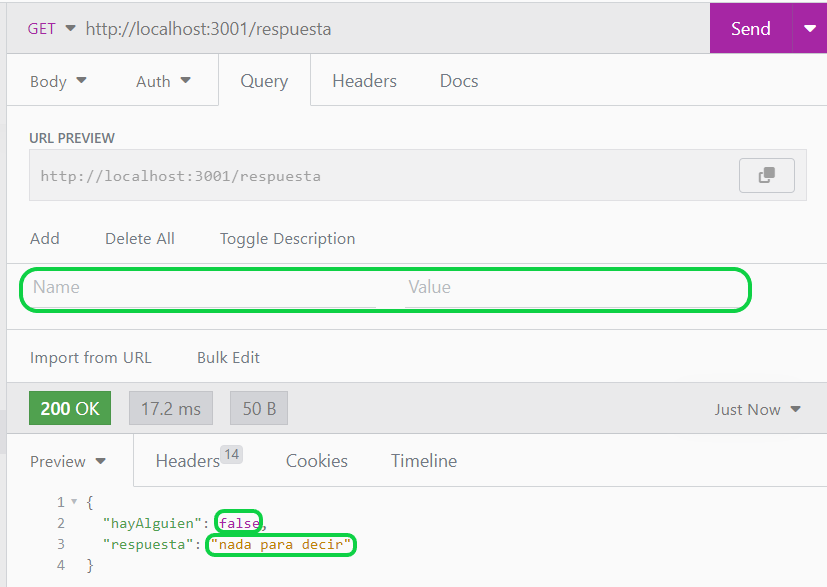

# Notas sobre backend

## Para empezar a leer los ejemplos
Podemos empezar a mirar en `/lib/app.js`. Ahí se configura el server Express y se le agrega el router que define los endpoints.  
El router está definido en `/lib/routes/index.js`. Ahora vamos a eso.

En rigor, el punto de entrada es `/bin/www.js`. Este archivo hace algunas inicializaciones (entre ellas la de la DB), y arranca el server Express definido en `/lib/app.js`. Esto es mayormente técnico, con arrancar desde `/lib/app.js` vamos bien.

## Configuración de un server Express
Obviamente, nunca está de más mirar la documentación de Express.  
**¡OJO!** - en los proyectos estamos usando Express 4 (de hecho la 5 todavía está en proceso de publicación, al 11/10/2024).

En principio dejen las configuraciones que están en `/lib/app.js`. La que seguro les conviene dejar al menos en desarrollo es la de `cors`, si la sacan, pueden tener problemas cuando quieran llamar de su FE a su BE.

## Endpoints
Un endpoint es una forma de hacerle pedidos al server. Se define por un método o verbo (GET / POST / DELETE / etc.) y un path, que es la parte de la URL que viene a continuación del server.

Para definir endpoints usamos los objetos Router que provee Express.

En `/lib/routes/index.js` encontramos esto
```
const router = express.Router();

// definición de un endpoint todo-en-uno
router.get('/saludo', (_req, res) => {
  res.json({ saludo: 'hola' });
});

// ... otros endpoints ...

export default router;
```

En `/lib/app.js` enganchamos este router a la aplicación Express.
```
import routes from './routes';

const app = express();
// ... inicialización de app ...
app.use('/', routes);

module.exports = app;
```

De este modo, Express va a exponer todos los endpoints definidos en el router.

Este código 
```
router.get('/saludo', (_req, res) => {
  res.json({ saludo: 'hola' });
});
```
define un endpoint de verbo GET y path '/saludo'. A los router se les puede enviar `post`, `delete`, etc. para definir endpoints con otros verbos.

A cada endpoint se le asocia un controller, que no es otra cosa que una función que recibe dos parámetros, que representan el pedido que recibió el servidor, y la respuesta que va a otorgar.  
Los controllers pueden ser `async`, eso nos va a servir para las interacciones con las BD.
El controller va a ser invocado cada vez que el server reciba un pedido para el endpoint asociado.

Lo principal que nos va a interesar del objeto response es pasarle la respuesta, la mayor parte de las veces en formato JSON.

## Usando el objeto request
Veamos ahora este código.  
```
router.get('/respuesta', (req, res) => {
  const paraQuien = req.query.paraQuien;
  res.json({
    hayAlguien: !!paraQuien,
    respuesta: paraQuien ? `cómo va ${paraQuien}` : 'nada para decir',
  });
});
```
Dentro del controller de este nuevo endpoint, hay una referencia a `req`, o sea, el objeto que representa el request (o sea el pedido). A este objeto le podemos pedir todos los parámetros del pedido, que son de cuatro tipos:
- path.
- query.
- body.
- header.
En el ejemplo estamos utilizando el query param `paraQuien`. En el controller nos preguntamos si el query param está definido, y lo usamos en la respuesta.

Abajo dos imágenes de llamadas a este endpoint, una donde se le pasa un valor para este query param y otra donde no.





## La estructura habitual de routers y controllers
En la carpeta `/lib/routes` tenemos varios archivos. Uno es `comidas.js`.  
```
import express from 'express';
import {
  getCarnes,
  showPasta,
  showPescado,
} from '../controllers/comida_controller';

import { withErrorHandling } from './utils';

const routerParaComidas = express.Router();

// como el routerParaComidas se va a enganchar con el router principal
// en el path /api/comidas,
// esta línea define un get para el endpoint GET /api/comidas/pastas
routerParaComidas.get('/pastas', withErrorHandling(showPasta));

// otros dos endpoints GET
routerParaComidas.get('/pescados', withErrorHandling(showPescado));
routerParaComidas.get('/carnes/:gramos', withErrorHandling(getCarnes));

export default routerParaComidas;
```
Acá definimos un `routerParaComidas` con tres endpoints y lo exportamos.  
Vemos una diferencia con las definiciones anteriores: el controller lo definimos en un archivo separado y lo importamos acá (además de wrapearlo con una función `withErrorHandling` que implementa un manejo básico de errores y se las recomendamos).

Veamos la definición de uno de estos controllers (recordemos que un controller es simplemente una función con dos parámetros `req` y `res`).  
```
export const showPasta = (_req, res) => {
  res.json({ tipo: 'ñoquis', salsa: 'pesto' });
};
```

Volvamos ahora a `/lib/routes/index.js`. 
```
import comidas from './comidas';

router.use('/api/comidas', comidas);
```
Acá le estamos inyectando al `router` principal el router de comidas que definimos en el otro archivo. 
> **Importante**  
> Para inyectar un router en otro usamos `router.use`. Así se distingue el encadenamiento de routers de la definición de endpoints, para lo que se usa `router.get`, `router.post`, etc..
>
El primer parámetro del `use` es un _prefijo_ de los paths que van a quedar definidos. En este caso, vamos a estar exponiendo tres endpoints con path `/api/comidas/pastas`, `/api/comidas/pescados` y `/api/comidas/carnes/:gramos`.  
> **Nota**  
> En el path `/api/comidas/carnes/:gramos`, la parte `/:gramos` es un _path param_. O sea que este endpoint responde a todos los pedidos GET con path `/api/comidas/carnes/<lo_que_sea>`, y el valor de `<lo_que_sea>` se puede obtener en el controller como `req.params.<lo_que_sea>`. Ver el ejemplo de controller para este endpoint.
>
Esta forma de organizar routers en dos niveles y controllers en archivos separados es muy común.


