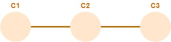

# Un repo es una red de commits
Dentro de un respositorio Git, el elemento básico es el _commit_. Un repositorio es una **red (o grafo) de commits**, ni más ni menos que eso.  
En [Think-like-(a)-git](http://think-like-a-git.net/) se hace una introducción de cierta extensión a la idea de grafo y cómo se usa en Git, puede ser una lectura interesante para le interesade.

Cada commit incluye la información necesaria para reconstruir el estado del repositorio en el momento en que se creó. En qué formato ... eso está fuera del limitado conocimiento de quien escribe esto, les curioses pueden mirar en el [libro oficial de Git](https://git-scm.com/book/en/v2/Getting-Started-What-is-Git%3F).  
Señalamos un detalle: cada commit mantiene una referencia a su _parent_, o sea al commit "anterior". Por eso algunos gráficos, que están concebidos con una visión ligada a la implementación de Git, la conexión pareciera estar "al revés".

.

El parent también se ve en algunas interfaces gráficas de Git, por ejemplo [GitKraken](https://www.gitkraken.com/).

.

En este material vamos a seguir la misma convención que los [tutoriales de Atlassian](https://www.atlassian.com/git/tutorials) y no vamos a poner ninguna flecha, asumiendo que el tiempo va de izquierda a derecha salvo aclaración explícita.

.


## Id de cada commit
Verán que el parent del commit C3 no está identificado como C2, sino con el número hexa `78403f`. Al commit C3 también se le asigna un número, en este caso `822139`.  
Git usa para identificar los commits un número hexa de 40 dígitos, el llamado "SHA-1", que parece ser un hash de algo ... que (otra vez) escapa a la comprensión de este escriba.
Estos identificadores se ven enteros al hacer p.ej. `git log`.

.

Notar que GitKraken muestra los primeros dígitos de cada id. Por lo general, este prefijo es suficiente para identificar a un commit, típicamente para usarlo en un comando.


## ¿Qué es "commitear"?
Al ejecutar `git commit`, se está _agregando_ un nuevo commit, cuyo parent será "el último" de los commits actuales.

``` 
git commit -m "C4"
```
.

Ahora bien, ¿cómo se determina cuál es este "último" commit, que va a ser el parent del nuevo? Aquí interviene el concepto de `HEAD`.


## HEAD es una referencia al commit "actual"
Cualquier carpeta local que sea el working tree de un repositorio Git mantiene lo que se llama "el `HEAD`", que es simplemente una **referencia** a un commit, que es el que se considera "actual" en cada momento.  

> **OJO**
> Esto no es exactamente así, vamos a ser más precisos un poco más abajo.

Las comparaciones con el estado del working tree o el stage area, p.ej. las que se obtienen mediante `git status`, se hacen respecto del commit al que apunte el `HEAD` en el momento de la comparación.  
Al commitear, el parent del nuevo commit será el commit (al que apunte) `HEAD`; y luego se "mueve" `HEAD` al commit recién creado.


Hay otros comandos que "mueven" el `HEAD`. En particular, `git checkout` tiene exactamente ese propósito. Translademos el `HEAD` al commit C3, usando su identificador SHA-1.

```
git checkout 822139
```


> **Pregunta**  
> Para quienes conozcan `git reset`, ¿qué diferencias hay entre` git checkout 822139` y` git reset 822139` ?

Subrayamos que lo que se está moviendo es la **referencia**, la red de commits sigue exactamente igual.

Además del `HEAD`, en Git hay otros conceptos que se manejan como referencias a commits, y que se usan (sobre todo uno de ellos) todo el tiempo.  
¿Se percibe cuáles son?


### Los commits anteriores a HEAD
Git incluye ¡tres! nomenclaturas (a falta de una) para los commits anteriores (en la línea de los `parents`) al `HEAD`.   
Para referirnos al commit anterior al `HEAD`, podemos indicarlo como `HEAD^`, `HEAD~` o `HEAD~1`. O sea, para "volver" el `HEAD` al commit `C3`, en lugar del id, podríamos haber hecho
```
git checkout HEAD^
```
o lo mismo, reemplazando `HEAD^` por alguno de sus dos sinónimos.

> **Pregunta**  
> Si _después_ de hacer esto, volvemos a ejecutar `git checkout HEAD^`, ¿qué pasa con el `HEAD`?

Para referirnos al commit que está 2 commits "atrás" de `HEAD`, o sea al "abuelo" de `HEAD`, podemos usar: `HEAD^^`, `HEAD~~`, o `HEAD~2`.  
Para movernos más hacia atrás, simplemente cambiar el `2` por el número de commits que se quiera retroceder, o agregar la cantidad deseada de `^` o `~`. P.ej., el commit que está 5 commits "atrás" de `HEAD` se puede referenciar usando `HEAD^^^^^`, `HEAD~~~~~`, o `HEAD~5`.


## Branches
Un **branch** es otro "sabor" de referencia a un commit. A diferencia del `HEAD`, que está ligado al working tree, los branches se registran en los repositorios locales y remotos. Cada commit tiene un nombre.   
Cuando se crea un repositorio, nace con un único branch, llamado `master`. 
Después se pueden crear todos los branches que se desee, al crear un commit se le pone nombre.  
Como un branch no es más que una referencia a un commit, es muy liviano: las acciones de creación y manipulación son muy rápidas.

En rigor, el HEAD apunta a un branch, no a un commit. Este es el commit que se reconoce como "actual", técnicamente es el _branch checkouteado_.
Al commitear, se mueve el branch actual, y por lo tanto, también HEAD.
Completenmos el gráfico de lo que pasa al realizarse un commit.


El comando `git checkout -b` tiene el _doble_ efecto de crear un nuevo branch que apunta al mismo commit que el branch actual (y `HEAD`), y setear el nuevo branch como actual (o sea, apuntado por `HEAD`) para el working tree. Luego de hacerlo.

```
git checkout -b task01
```

podemos ver los efectos usando `git branch` y `git status`.


El estado completo del repositorio queda así, donde destacamos el branch checkouteado mediante un recuadro en el nombre.  


> **Para mirar**  
> ¿Qué cambia si en lugar de `git checkout -b task01` se ejecuta `git branch task01`?

Si en esta situación agregamos un commit, pasamos a esta situación.


Como un branch es una referencia a un commit, muchos comandos admiten un id de commit o nombre de branch indistintamente. Para "volver" el `HEAD` al commit C4, podemos ejecutar

``` 
git checkout master
```

El repo + working tree queda así


notamos que al hacer `checkout` sobre un _branch_, también cambia el branch actual.

## Por qué "branch"
Si **ahora** creamos un nuevo branch, ¿de dónde va a salir? De `HEAD`, claro
``` 
git checkout -b task02
```


Si agregamos un nuevo commit, va a tener como parent a `C4`. Se van a mover `HEAD` y el branch actual, el resto se queda donde está.


Aparece una **ramificación** en el repositorio, este fenómeno es el que le da sentido al nombre "branch", o sea _rama_.


## Detached HEAD
Supongamos que ahora queremos ver en qué estado estaba el repo en el commit C2. Fácil: averiguamos el id y hacemos el checkout correspondiente.


¿Qué es eso de `'detached HEAD' state`?  
Con este mensaje, Git nos está avisando que al apuntar `HEAD` directamente a un commit, en lugar de hacer referencia a un branch, el working tree no tiene un branch actual, y HEAD apunta directamente a un commit. Se pueden hacer commits, pero Git los va a considerar como provisorios: se descartan al "pararnos" en un branch usando nuevamente `git checkout`.  
Si queremos que esos cambios queden registrados, se puede crear un branch (que nace con el tip en donde esté apuntando `HEAD`).

> **Micro desafío**  
> Crear un nuevo branch `task03` _partiendo desde el commit C3_, y agregarle un commit. Dibujar cómo queda el estado del repositorio y dónde queda el `HEAD`.


## Branch tip
Cerramos con un pequeño comentario: aunque técnicamente un branch no es más que la referencia a un commit, conceptualmente se asocia a la secuencia de commits que termina en el referenciado. Por eso a veces se menciona como "branch" a toda la secuencia, y _branch tip_ al commit apuntado.


