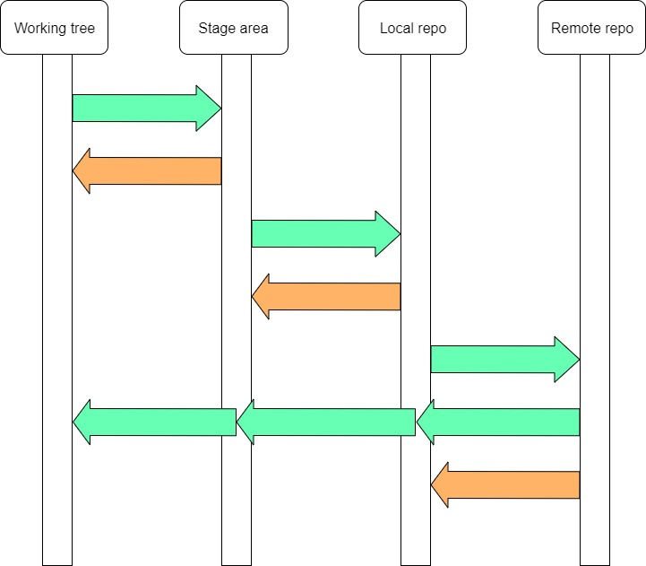

# Los "lugares" de Git
El uso de Git arranca relacionando una carpeta de un disco local, con un repositorio. Eso define varios "lugares":
- el directorio de trabajo o "working tree", o sea, la carpeta local.
- la llamada "stage area", donde hay que depositar los archivos que después se quieran commitear.
- el repositorio local.
- el repositorio remoto.

En muchos tutoriales de Git aparecen gráficos parecidos al que sigue, que muestran estos distintos "lugares" o "espacios". Las flechas son comandos de Git que permiten "pasar" (en rigor, copiar) archivos de un lugar a otro.

El primer desafío es completar las flechas, indicando (al menos) una operación que mueva información en la dirección indicada por cada una.
Las flechas verdes corresponden a los comandos más habituales del día a día. Los naranjas tal vez los tengan que pensar un poquito más, en particular la última mirando de arriba hacia abajo.
Las tres flechas encadenadas corresponden a una única operación que actualiza los tres espacios.

Tracen también una línea que permita ver qué comandos se pueden utilizar sin conexión a Internet.

Agrego algunas preguntas para verificar que estamos alineados.
- ¿se puede tener un repo local que no está relacionado con ningún repo remoto? ¿Cuál es el comando para crear un repo local "independiente"? ¿Cómo se hace si después se lo quiere asociar a un repo remoto existente?
- ¿a cuál/es de estos espacios afecta `git merge`?
- ¿cuál es la (opción de) comando para hacer en un solo paso la transición de working tree a stage area, y de ahí a repo local? ¿Siempre se puede hacer?

**Comentario final**  
El diagrama de acá arriba muestra los espacios que se ven por lo general en las explicaciones iniciales de Git.

Pero siendo un poco más finos, encontramos que en realidad existe un espacio adicional, que por lo general no aparece en las explicaciones.  
En [este post](https://www.reddit.com/r/git/comments/99ul9f/git_workflow_diagram_showcasing_the_role_of/) se muestra el diagrama incluyendo ese espacio. Algunos de los comentarios también valen la pena.

