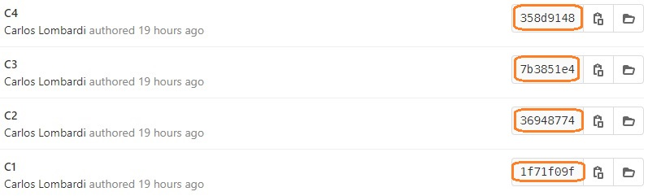
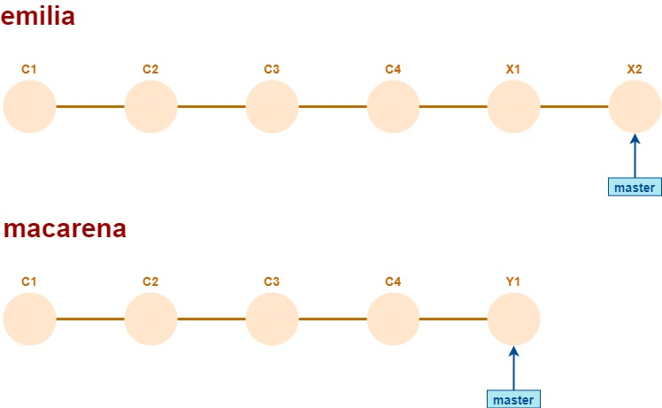

# Repositorios remotos
Todos los comandos de Git que estudiamos hasta ahora (`add`, `commit`, `reset`, `revert`, `log`, etc.) y en todos los ejemplos y ejercicios que repasamos, interactuamos únicamente con _repositorios locales_. Recordemos, estos son repositorios (con toda la lógica de commits y branches) que están alojados junto al working tree (más precisamente, en la carpeta `.git`).  
En esta página, vamos a incorporar a los _repositorios remotos_ en nuestro estudio de características de Git.

Un repositorio remoto tiene las mismas características que estudiamos sobre los repositorios locales: es básicamente una red de commits, puede incluir branches que son referencias a commits, pueden tener commits huérfanos, etc.. 
También tienen un `HEAD` ... aunque honestamente, no sé para qué se usa.


## Relaciones entre repositorios locales y remotos
Un repositorio local _puede_ estar vinculado a un repositorio remoto, _o no_. 
Para crear un repositorio local en una carpeta, alcanza con ejecutar `git init`.  
Todos los ejemplos que analizamos hasta ahora, se pueden reproducir en repositorios locales no vinculados a remotos.

En esta imagen, se puede observar la creación de un nuevo repositorio local, el agregado de dos commits, y el resultado de ejecutar luego `git log`. Al final se ejecuta `git remote`, el resultado vacío muestra que el repositorio local no está vinculado a ningún repositorio remoto.  


El comando `git clone` realiza tres operaciones: crea un nuevo repositorio local, lo vincula con el repositorio remoto que se indica, y vuelca toda la red de commits y branches del repositorio remoto al local.  
  
Podemos ver varias diferencias. 
- El log muestra los branches y HEAD remotos en color rojo, asociándolos con la palabra "origin", p.ej. `origin/master`. 
- La respuesta a `git remote` ahora indica que hay un repositorio remoto llamado `origin`. Ejecutando `git remote show origin`, se puede acceder a información sobre el repo remoto, incluyendo la URL.

Los commits en los repos local y remoto se relacionan porque mantienen los mismos id. Esta es la vista de los commits del repo remoto del que mostramos el clone recién, los ids de cada commit se ven a la derecha.  
  


### Varios remotos
Un repositorio local puede estar vinculado a _varios_ repositorios remotos.  
  

Para cada repositorio remoto que está vinculado al local, se establece un nombre. El nombre refiere _a la vinculación_, no al repo remoto.  
Al hacer `git clone`, a la vinculación del repo local al remoto que se está clonando, se la llama `origin`. Este es el famoso "origin" que se ve p.ej. en 
```
git push origin master
```
Si tengo más de un remoto, en el `push` puedo indicar a cuál pushear.

Al agregarle más remotos a un local, se puede establecer el nombre que se le va a dar a la vinculación con cada uno.

La técnica de tener varios remotos para un mismo repo local no es algo _tan_ esotérico. P.ej., es usada en [Heroku](https://www.heroku.com/home). Para publicar un repositorio como una app Heroku, se abre un segundo remoto sobre Heroku. Cada push a ese remoto genera un nuevo deploy.   
Se puede usar también para material que se presenta en distintos lugares a medida que se va evolucionando. Se puede abrir un remoto para cada vez que se presenta, ese remoto se le puede publicar a los participantes, y esa versión queda fija aunque el material evolucione en "su" repositorio. Como una variante más brutal de la idea de branch.

Los comandos `git pull` y `git push` sincronizan el repositorio local con un repositorio remoto. Para entender cuál de los remotos si tenemos varios, tenemos que hablar del _upstream_. Antes practiquemos un poco.


### Para experimentar / buscar / pensar
Googleando `git remote add` / `git remote remove`:
- agregar como segundo remoto a un repo local clonado, un repo remoto recién creado.
- pushear el branch actual en el segundo remoto, verificar los resultados.
- lograr que el repo local tenga como remoto _únicamente_ el que se vinculó recién. Verificar que ya no tiene un remoto llamado `origin`.

¿Se puede lograr que haya varios repositorios locales en un mismo equipo, vinculados al mismo repositorio remoto? ¿Cómo se puede lograr?

¿Qué diferencia hay entre estas dos variantes (la única diferencia es el punto del final)?
- `git clone <url_remoto>` 
- `git clone <url_remoto> .` 


### La vinculación a nivel de branches - upstream de un branch
A su vez, cada _branch_ en el repo local puede estar vinculado a un branch en un repositorio remoto. Es el llamado **upstream** del branch local.  
Esta vinculación se establece mediante los comandos `git push -u` o `git branch -u`, donde el `-u` es una forma abreviada para `--set-upstream` (para `git push`) o `--set-upstream-to` (para `git branch`). 

Ese es el branch que se tiene en cuenta en `git status`.
  

Comparar con un branch que no tiene upstream.
  


El upstream es el branch que se actualiza al hacer `git push`, si no se aclara cuál es el remoto/branch a actualizar.  
  

Lo mismo pasa para `git pull` ... con una sutileza de la que hablaremos más adelante.


### Algunas preguntas/desafíos adicionales
Cuando se _crea_ un branch local ¿está vinculado a algún branch remoto? ¿Cómo se hace en general para establecer el vínculo?

A partir de un repositorio remoto de esta forma  
  
1. Generar una copia local.
1. Verificar usando `git branch` si se generaron branches locales para cada branch remoto.
1. Ejecutar `git checkout task01`. Notar que no se indicó `-b`. ¿Genera un upstream para el branch local? 
1. Ejecutar `git checkout task03`, o sea, con un nombre que no corresponde a un branch remoto. ¿Qué pasa?
1. Crear un branch que tiene correspondencia remota, p.ej. `git checkout -b task02`. ¿Genera un upstream en este caso? Si no lo genera ¿cómo crear la vinculación con `origin/task02`?
1. Agregar un segundo remoto, contra un repositorio remoto vacío.
1. Hacer push del branch `task02` sobre el segundo remoto, _sin cambiar el upstream_, que tiene que seguir apuntando a `origin`. ¿Cómo se espera que quede el nuevo remoto? Verificar.
1. Actualizar las referencias de los otros branches del repo local en el segundo remoto.
1. Borrar la referencia al segundo remoto, que quede solamente `origin`.
1. Crear branches locales `tarea01` y `tarea02`, cuyos upstream sean los branches `task01` y `task02` de `origin`.
1. Borrar los branches locales `task01` y `task02`.
1. Agregar un commit en `tarea02`, hacer `git push`, verificar que se agregó al branch `task02` del repo remoto.

El repo local termina así:  
  
El repo remoto igual, con los nombres de branch `task01` / `task02` en lugar de `tarea01` / `tarea02`.


## Sincronización - casos sencillos
Cada operación de sincronización, o sea cada vez que se ejecuta `git pull` o `git push`, hay un repositorio origen y uno destino: cada operación va _en un solo sentido_. El objetivo de la sincronización es que el destino incorpore las novedades incorporadas en el origen. 
- En `git pull`, el repo destino es el local, el objetivo es que tome las novedades del remoto.
- En `git push`, el repo destino es el remoto, el objetivo es que los cambios registrados en el repo local pasen al remoto. 

Como ya dijimos, la sincronización aplica sólo al branch actual, con una sutileza en el `git pull` de la que hablaremos más adelante.

La sincronización es sencilla cuando los branches existentes en el origen están en el mismo lugar, o más adelante, que en el destino.
En este caso:
  
se puede sincronizar cualquier branch existente en el destino sin problema, quedando igual que en el origen.

> **Pregunta**  
> Esta situación ¿corresponde más bien un pull o un push?

Incluso si el origen tiene esta forma  
  
también la sincronización va a poder hacerse sin problemas, la diferencia con el caso anterior es que `master` también se mueve hacia adelante. 

También podemos variar el destino  
  
En este caso, el destino no va a quedar igual que el origen: los commits F1 y F2, y el branch `task04`, van a permanecer en el destino aunque no estén en el origen.


### Pregunta
Si el repo origen tiene esta forma  
  

y el destino esta  
  

¿se puede hacer la sincronización sin problemas? ¿Cómo queda el repo destino?
¿Cómo sería la situación invirtiendo los repositorios origen y destino?

Para probarlo en los dos sentidos, a partir de un repositorio remoto de esta forma
  
hacer **tres** copias locales.

Con todas las copias locales generadas, empezamos probando el `pull`. Para eso: primero sobre la copia 1 avanzar en `task02` y pushear, luego sobre la copia 2:
- hacer `git checkout task02`,
- hacer `git checkout task01`,
- agregar un commit en `task01`, 
- hacer `git pull` para traerse las novedades (que no debería haber) sobre el branch `task01`
- hacer `git checkout task02`, y finalmente
- hacer `git pull` para traerse las novedades sobre el branch `task02`.

Ahora probamos el `push`. Sobre la copia 3:
- hacer `git checkout task02`,
- hacer `git checkout task01`,
- agregar un commit en `task01`, 
- hacer `git push` para subir al remoto las novedades sobre el branch `task01`.
- ver cómo quedan los repos local y remoto.


## Sincronización - casos conflictivos
Cuando en el origen hay un branch que no está en el mismo commit, o más adelante, que en el destino, se genera un conflicto.

Vamos con un caso sencillo, un `git commit --amend` sobre el último commit, seguido por un `git push`. Si el último commit no estaba en el repositorio remoto, no hay conflicto.  
  
El tip de `master` en el origen, C4.1, tiene como parent a C3, el tip del mismo branch en el destino.

Si el commit que "modificamos" sí estaba en el remoto, se genera un conflicto.  
  
El commit C4.1 no está adelante del C4; podríamos decir que está "al costado", ninguno es antecesor del otro.

Por esto es que se recomienda que los `git commit --amend` y los `git reset` no involucren a commits que ya están pusheados.

Si el branch en el origen está _detrás_ del tip en el destino, entonces el comportamiento depende de la operación
- si es un `git pull`, no se considera un conflicto, y no se mueve el branch en el repo local. Se considera que se está haciendo un pull de un branch en el que se avanzó local, por lo que resulta correcto no moverlo.
- si es un `git push`, sí se considera un conflicto.


### Para ver qué pasa
Generar una copia local de un repositorio remoto de esta forma  
  
y hacer las siguientes pruebas
1. retroceder `master` mediante `git reset --hard`, y luego pushear.
1. revertir el último commit usando `git revert`, y luego pushear.

El comportamiento del push ¿es el mismo en los dos casos?


## Qué pasa en caso de conflicto
El manejo de conflictos es distinto para push que para pull.

### Conflictos en git push
Si hay conflicto en el `git push`, la operación se rechaza indicando que los conflictos deben resolverse.  
Es importante entender que **toda resolución de conflictos es local**; a los repositorios remotos les llega _el resultado_.

Una alternativa es hacer `git push -f`, o sea **forzar** a que el branch en el repo remoto quede en el estado en que esté en el repo local. 
Pero esto tiene un alto riesgo de complicarle la vida a todas las personas que estén trabajando sobre el mismo branch. 

Volvamos al ejemplo del `git commit --amend`. Supongamos que la situación actual es esta  
  

y que un desarrollador realiza un `git push -f` que deja al repositorio así.  
  

Si hay otras dos desarrolladoras que avanzaron sobre el mismo branch  
  

entonces les estoy generando un conflicto cuando ellas quieran hacer `pull`.

Por eso el `push -f` es una operación que hay que usar con mucha precaución.
Eso ¿quiere decir que no debe usarse _nunca jamás_? Personalmente, creo que conviene analizar el caso.
- sobre un branch sobre el que está trabajando una única persona, el `push -f` no le causa problemas a nadie.
- sobre un branch sobre el que se está desarrollando una tarea en que trabajan, digamos, dos o tres personas que tienen comunicación fluida, puede ser más sencillo coordinarse para recuperarse rápido de los efectos del un push forzado. El `pull --rebase` puede ayudar.
- sobre un branch de integración, ahí sí que en principio no hay que hacer `push -f` jamás de los jamases.

Muchas veces, la alternativa a los push forzados es un merge, que implica un merge commit. Si siempre elegimos la opción que nos lleva a un merge, corremos el riesgo de que el repo se nos llene de merge commits y que sea difícil entender la historia.  
Vamos a volver a hablar sobre esto al tratar las operaciones de merge y rebase con un poco más de detalle.


### Conflictos en git pull
Si se detectan conflictos en el `git pull`, el mismo comando ejecuta un `merge`, que genera un merge commit en el que se replican en el repo local, los cambios que sólo están en el remoto.  
  

En GitKraken se ve así  
  

El merge commit tiene dos parents.

Si surgen conflictos en el merge (tema del que hablaremos más adelante), deben ser resueltos para cerrar el pull.


### Preguntas y ejercicios
Si en la situación previa al merge se quiere hacer un `push` ¿lo va a permitir? ¿Cambia la situación después del merge? Explicarlo comparando dónde están los tip del branch en cada caso.

A partir de un repositorio remoto de esta forma.  
  
hacer tres copias locales. Con las tres copias inicializadas, hacer lo siguiente.
- en una copia, hacer `commit --amend` para cambiar el nombre del último commit, y luego `push -f`.
- en la segunda, agregar un commit que agregue un par de líneas al final de un archivo, y luego hacer `git pull`.
- en la tercera, agregar un commit igual al de la segunda, y hacer `git pull --rebase`.

Comparar cómo quedaron las copias 2 y 3.


## Git fetch y un espacio adicional de Git
Entre la gran cantidad de comandos de Git, son pocos los que interactúan con repositorios remotos. 
En esta página aparecieron cuatro: `git pull`, `git push`, `git remote`, y ... ¿cuál es el cuarto?

Otro comando relacionado con repositorios remotos es `git fetch`. Este comando obtiene el estado actual de un repositorio remoto, actualizando localmente  ... ¿qué precisamente?   
Para responder a esta pregunta, hagamos un experimento. Consideremos un repositorio local sencillo  
  
que está sincronizado con su único remoto, `origin`.  
  

Notemos la variante `git log --oneline --all`. Con `--oneline` obtenemos una vista consolidada del log. A su vez, `--all` hace que aparezcan todos los commits, no solamente los ligados con el branch actual. Por ahora esto no hace diferencia, pero ya la va a hacer.

Supongamos que otro usuario del mismo repositorio remoto agrega un commit a `master`. Por lo tanto el repositorio remoto queda así.  
  

Si ahora ejecutamos los comandos de consulta, o sea `git status` y `git log`, van a dar el mismo resultado que antes. 
Esto muestra que estas operaciones **no consultan al repositorio remoto**.

Ejecutamos ahora `git fetch` y luego volvemos a hacer las consultas. Ahora sí vamos a ver diferencias.  
  

Ahora informa correctamente que el branch `master` local está un commit más atrás que su upstream, y que hay un nuevo commit C5, que es el tip del branch remoto.

Por lo tanto, `git fetch` actualiza _un "espejo" local del repositorio remoto_. El repositorio local incluye (o al menos se comporta como si incluyera) los branches remotos además de los locales. Con la diferencia, claro, que los branches locales se pueden mover, mientras que los remotos sólo cambian al hacer `git fetch` o `git pull`.  
Conceptualmente, podemos pensar en un ["espacio" de Git](./git-espacios) adicional:  
  

Los branches remotos son referencias, pueden ser utilizados en los comandos que reciben un id de commit o nombre de branch.

El `git pull` incluye un `fetch` como paso inicial, por eso no es necesario hacer un fetch antes de cada pull.


### Otra tanda de ejercicios
Sobre el repositorio local como quedó al final del ejemplo, utilizar el commit `origin/master` en comandos de Git, p.ej. `checkout` o `reset`.

Probar también `git diff master origin/master`. El comando `git diff` compara el estado de dos commits, todo o para un archivo específico.

Sobre el mismo repositorio, agregar un commit local. Luego ejecutar las consultas `git status` y `git log`, el segundo con esta variante
```
git log --oneline --all --graph
```
El `--graph` arma un gráfico similar al que muestran las herramientas gráficas como GitKraken; con las limitaciones de una consola de texto, claro.

A partir de la información que brindan las consultas, anticipar qué haría `git pull`.


## Comentario final
Notamos que `git fetch` actúa sobre _todos_ los branches. Por lo tanto, **cada repo local incluye una copia completa del remoto**, actualizada ante cada `fetch` o `pull`.
Esto muestra el carácter masivamente distribuido de Git, y la bajísima posibilidad de perder información en forma irrecuperable, dada la cantidad de copias.


