# "Deshaciendo" o "modificando" cambios - reset, commit --amend, revert
Al agregar un commit, podemos considerar que el branch actual y `HEAD` _avanzan_ un paso: se mueven "hacia adelante", apuntando al commit recién creado.  
¿Cómo se hace para lograr un **retroceso** de un branch, para "arrepentirnos" del último commit registrado, borrarlo y volver el tip del branch y `HEAD` "un commit para atrás"?  
Para ser precisos, lo que queremos es que `HEAD` y el branch vuelvan al _parent_ del commit actual.

Mediante `git checkout`, se puede mover `HEAD` al parent ... o a cualquier commit que querramos.
Como toda la información commiteada está en el repo, no se pierde nada salvo lo que pudiera estar _solamente_ en el working tree o en el stage area: lo que ya se commiteó, no se va a perder por andar moviendo `HEAD`. Si vuelvo a mover `HEAD` a un commit conveniente, las versiones actualizadas van a volver a aparecer en el working tree. 
Esto nos sirve para consultar en qué estado estaba el repo en un determinado commit, pero no para mover branches.

Para mover al mismo tiempo el `HEAD` y el branch checkouteado, está `git reset`. Este comando tiene variantes interesantes para ajustar la comprensión sobre los distintos [espacios de Git](./git-espacios). También nos sirve para quitar elementos del stage area. Un super-comando el `git reset`.


## Deshaciendo el último commit - los tres modos de git reset
Un escenario típico de uso de `git reset` es cuando poco después de haber agregado un commit, nos damos cuenta de que nos apresuramos, o que no lo armamos en forma correcta.  
Por lo tanto, queremos que el branch actual y `HEAD` vuelvan "un commit para atrás", o sea

```
git reset HEAD^
```

El efecto que tiene este comando **en el repo** es el siguiente.

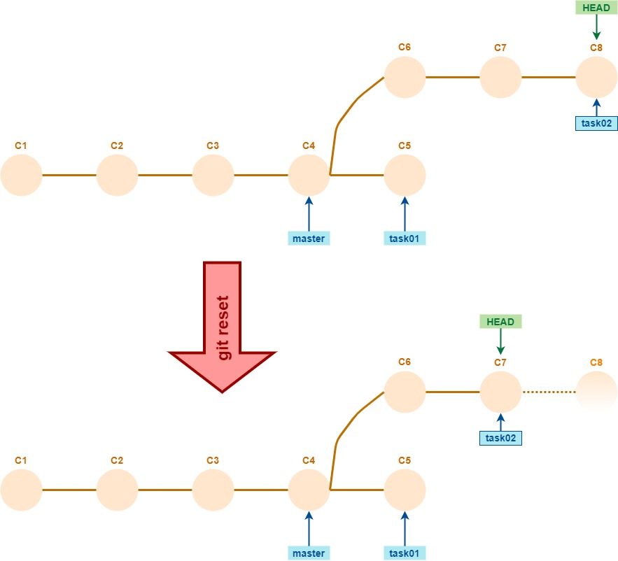

(qué pasa con el commit C8 lo vamos a ver más adelante).

Nos falta decidir cómo queremos que queden el working tree y la stage area. Dicho de otra forma, qué queremos hacer con los _cambios_ registrados en el commit que estamos "tirando para atrás". 
Hay tres opciones, a cada una le corresponde una variante del comando `git reset`. 
En resumen, tenemos:
- `git reset --soft HEAD^`: los cambios quedan en el stage area y en el working tree.
- `git reset --mixed HEAD^`: los cambios quedan solamente en el working tree, hay que agregar al stage area lo que se quiera commitear.
- `git reset --hard HEAD^`: los cambios no quedan en ningún lado. En principio, se pierden. En realidad, no se pierden del-todo-del-todo, esto tiene que ver con el status en que queda el commit C8 ... hablaremos sobre esto más adelante.

El default es `--mixed`, o sea, `git reset HEAD^` es equivalente a `git reset --mixed HEAD^`.

Contamos las tres variantes con gráficos que suponen que el commit descartado agrega el archivo `3.txt` a un repo que incluía `1.txt` y `2.txt`.

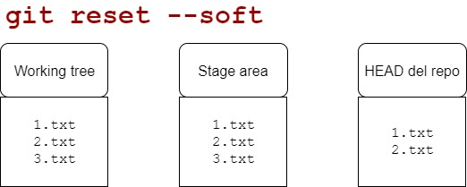

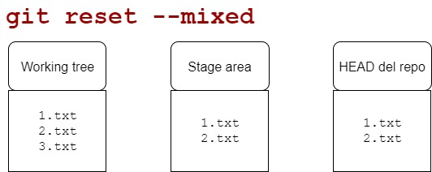

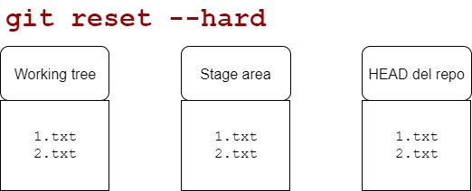

**Importante**  
Notar que la _única_ variante que modifica el working tree es `git reset --hard`.

### Algunos ejercicios
Sobre un repositorio, generar un commit que modifique dos archivos.
Después, deshacer ese commit (usando `git reset`) y reemplazarlo por dos commits secuenciales, uno para los cambios de cada archivo.

Si en un repositorio en este estado (notar en particular cuál es el branch actual)  
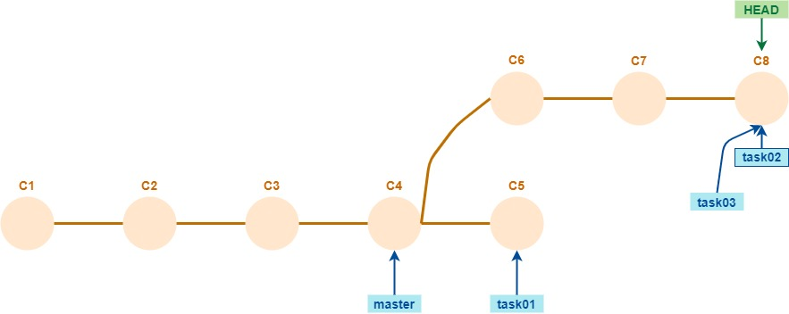
se hace un `git reset --hard HEAD^`, ¿se pierden los cambios registrados en C8? Si no se pierden, ¿cómo se puede hacer para verlos?

Sobre un repositorio, generar un commit que agregue un archivo y elimine otro. 
Pensar cómo quedaría el working tree, y cuál sería el resultado de `git status`, luego de un `git reset HEAD^`. Lo mismo con `git reset --hard HEAD^`. Después probar y verificar.  
**Nota**:  
para que sea fácil hacer las dos pruebas, después del último commit y antes de probar `git reset`, copiar todo el working tree a otra carpeta _incluyendo archivos ocultos_ y con _copia recursiva_. Si se hace así, la nueva carpeta también va a ser un repositorio Git. Ahora se puede hacer una prueba en cada carpeta.


## Reset en cualquier dirección
¿Qué pasa si se hace `git reset --soft HEAD~2`?  
El efecto _en el repositorio_ es el imaginable: el branch actual y `HEAD` se mueven **dos** commits hacia atrás.  
_En el working tree y en la stage area_, se van a _consolidar_ los cambios de los dos commits.


OK, entonces `git reset` permite ir hacia atrás todo lo que querramos. ¿Permitirá ir _hacia adelante_?
Sí, es posible hacer eso. En rigor, `git reset` permite cambiar el branch actual y `HEAD` a **cualquier commit**. Si se usa `git reset --soft`, calcula la diferencia entre el commit actual y el que se indica, y con eso arma la stage area.


### A probar
Generar un repositorio de esta forma  
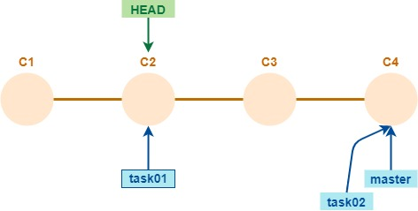  
en el cual cada branch va agregando líneas a un único archivo de texto.
**OJO** - prestar atención a cuál tiene que ser el branch actual.  
En esta situación, hacer `git reset task02`. Pensar qué diferencia hay entre el working tree y `HEAD`. Verificarlo mediante `git diff`.  
Para volver a la situación anterior, alcanza con `git reset <id-del-commit-C2>`. Verificarlo.

Sobre la misma situación inicial, probar con `git reset --hard task02`. Pensar cómo queda el working tree y qué cambios muestra `git status`. Verificar.  
Pregunta: a partir de la situación posterior al `git reset --hard`, ¿se puede volver exactamente a la situación inicial? ¿Cómo?

A partir de la misma situación inicial, hacer las operaciones necesarias para "invertir" los tips de los branches `task01` y `task02`. O sea, que el repo quede así.
  

A partir de la misma situación inicial, 
- borrar el branch `task02`, quedan solamente `task01` en C2 y `master` en C4.
- pararse en `master`, agregar dos commits, digamos C5 y C6. 
- En ese momento "darse cuenta" de que esos dos commits corresponden a un nuevo branch `task03`. Lograr que `task03` esté en C6, y que `master` "vuelva" a C4.

## Correcciones sencillas al último commit - commit --amend
Volvamos al escenario con el que arrancamos esta página: se armó mal el último commit. Puede ser p.ej. que nos hayamos olvidado de agregar un cambio, y/o que querramos cambiar el mensaje.

Para estos casos, una opción más sencilla es el `git commit --amend`. Si en un repositorio de esta forma  
  
hacemos `git commit --amend -m "C4.1"`, obtenemos esto
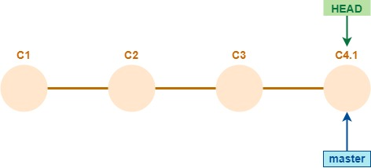  

Hagámoslo, mirando el resultado de `git log --oneline` antes y después.
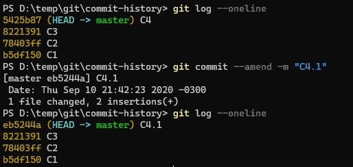  

Bien, el nombre del commit cambió efectivamente de `C4` a `C4.1`.


## Git no pierde nada - reflog
Mirando con detenimiento el último screenshot de la consola, podemos descubrir que hay algo más que cambió, además del nombre del commit.

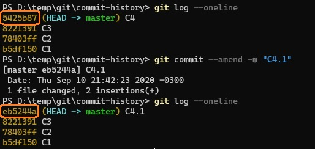  

La otra diferencia está en el _id del commit_. ¿Puede cambiar el id de un commit? No, los id no cambian. Lo que ocurre es que en realidad, el resultado de la operación `git commit --amend` es la creación de un _nuevo_ commit. La única diferencia con el `commit` normal es que el _parent_ del nuevo commit no es el commit actual, sino el parent del commit actual. En realidad, el repo después del `commit --amend` anterior queda así.  
  

El commit C4 queda "huérfano", en el sentido que no se puede acceder a partir de ningún branch. Pero sigue existiendo, y sigue teniendo el id que empieza con `5425b87`. Por ejemplo, si hacemos 
`git checkout 5425b87`
el `HEAD` va a apuntar (en modo "detached") al commit C4.

Por eso pusimos entre commilas las palabras "deshaciendo" y "modificando" en el título de esta página. 
En principio, **Git no borra ningún commit**. Esto permite reparar errores y volver a cualquier estado en el que el repositorio haya estado en algún momento.

En nuestro caso, contar con el id del commit huérfano nos sirve para "arrepentirnos" del cambio de nombre y volver a C4. Alcanza con volver a `master` (`git checkout master`) y después hacer
```
git reset --hard 5425b87
```
Ahora el commit "huérfano" es el C4.1.  
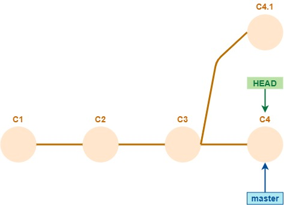  

Si ya "perdimos" el id del commit que quedó huérfano, tenemos otra fuente de información que es el **reflog**. Este es un registro de cada operación que se hizo en un repositorio, que indica el id del `HEAD` en cada paso. Después del `git commit --amend`, este es el `reflog`.

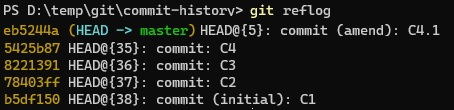  

Vemos que aparecen los ids de todos los commits, incluso el huérfano.

Git incluye un garbage collector que limpia los repositorios de commits huérfanos. Pero para que limpie un commit, si entendí bien, hay que eliminar sus referencias en el reflog. A partir de estas ideas se puede explorar una parte de Git que está ampliamente fuera de mi alcance. Sólo hice una pequeña prueba basada en [esta respuesta en Stack Overflow](https://stackoverflow.com/a/29203553/7405996) que parece haber funcionado. 


### Más ejercicios
Plantear un escenario en el que hacer un `git reset` genera que _dos_ commits queden huérfanos.

A partir del escenario posterior al `git commit --amend`, o sea  
   
realizar las operaciones necesarias para que el repositorio quede así
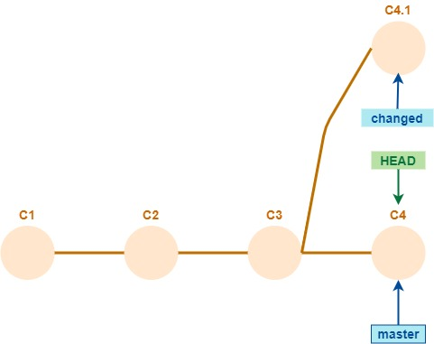   


A partir de un repositorio de esta forma  
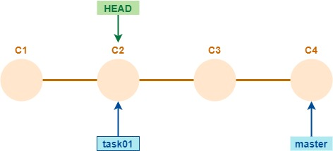   
cambiarle el nombre al commit C2 usando `commit --amend`. Verificar usando `git log` que efectivamente cambió el nombre. Después hacer `git checkout master` y luego `git log`. Probablemente haya algo sorprendente en el resultado. Analizarlo y obtener conclusiones sobre el carácter delicado del `commit --amend`.


## Revert - la cancelación queda registrada
Volviendo al objetivo original de "deshacer" Una alternativa a `git reset` es `git revert`. 

_En el working tree_, el efecto de `git revert` es el mismo que `git reset --hard`: se vuelve al commit anterior.  
Por otro lado, el efecto _en el repositorio_ es distinto: la operación `git revert` _agrega_ un commit, o sea, el `HEAD` y el branch actual avanzan. El nuevo commit **invierte** al último: elimina los archivos agregados, agrega los eliminados, y revierte las modificaciones.  
Por lo tanto, en la historia del branch van a quedar los dos commits: el original, y el que genera `git revert`. 

Si sobre este repositorio  
  
ejecutamos `git revert HEAD`, el estado después de la operación es  
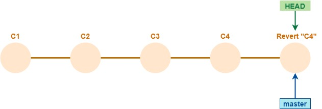  

Mirémoslo en la consola  
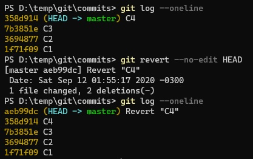  

La opción `--no-edit` evita que se abra una ventana para que se pueda cambiar el mensaje del commit que se agrega.

Veamos el efecto en el working tree, usando `git diff` podemos verificar que el commit `Revert "C4"` invierte las acciones del `C4`.  
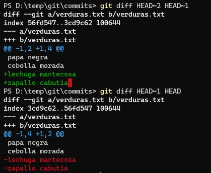  

En este caso, el commit `C4` (que es `HEAD~1`) agrega dos líneas al archivo `verduras.txt`, y el commit `Revert "C4"` (o sea, `HEAD`) las elimina.

En particular, el `git revert` es útil para anular (en el estado del repositorio) los efectos de un commit que ya está subido a un repositorio remoto. Mover un branch usando `git reset` puede causar problemas al sincronizar el repositorio local con el remoto. Agregar un nuevo commit es una operación mucho menos conflictiva.


### Variantes que pueden ser de interés
Se pueden revertir varios commits en una sola ejecución del comando. Genera un commit de reversión por cada commit que se revierte. P.ej. para revertir los últimos dos commits (y que no abra el editor para el mensaje de cada nuevo commit) alcanza con ejecutar
```
git revert --no-edit HEAD~2..HEAD
```

La opción `-n`, o `--no-commit`, inicia una sesión interactiva de `revert`. En lugar de generar el o los commits, deja los cambios en el stage area. Con `git revert --continue` se completa el revert, también está la opción de `git revert --abort`. Para ver la lista de posibilidades en cada momento, `git status`.

En rigor, se puede revertir _cualquier_ commit o conjunto de commit. Si se revierte un commit que no es el último, pueden surgir conflictos similares a los de merge, y el `revert` queda abierto para que se resuelvan los conflictos.

### Ejercicios finales
Para probar el `revert` de un commit que no es el último, armar un repositorio con esta forma  
  
donde C1 crea tres archivos, y los commits C2, C3 y C4 modifican cada uno, un archivo distinto.  
Sobre este repositorio ejecutar `git revert --no-edit HEAD~1`, y observar los efectos.

Sobre un repositorio en este estado
   
pensar cómo queda el repositorio si se hace `git revert --no-edit HEAD`. Verificar probando.


