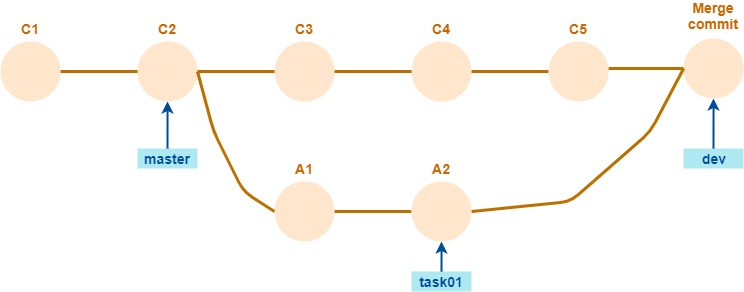
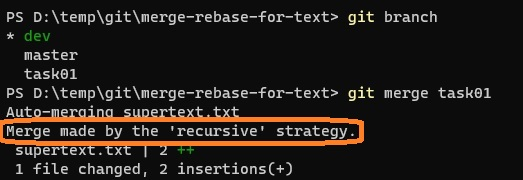
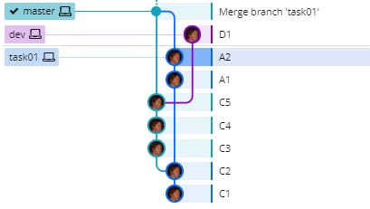

# Sincronización de branches - merge y rebase
Definir branches separados para cada tarea es muy útil, para evitar que un proyecto en el que trabajan muchas personas caiga en un estado de caos constante.
Ahora, el objetivo de la mayor parte de los branches de tarea (o de corrección de bugs) es _integrarse_ en un branch que (justamente) integra el trabajo de varias personas o equipos. En muchos proyectos, se define un branch llamado `dev` o `develop` para este propósito.  

Por lo tanto, una operacion habitual en el trabajo con branches es la de **sincronizar** el estado de dos ramas.  
Los comandos `git pull` y `git push` son operaciones de sincronización, en los que una de las ramas es remota y la otra local, p.ej. al hacer `git pull origin task01` se están sincronizando los branches `task01` y `origin/task01`.

En otras ocasiones, la sincronización se da entre dos branches locales.  
En particular, una de las estrategias para "subir" los cambios de una branch de tarea a una de integración es hacer el merge local, y subir los resultados al repo remoto. 

Finalmente, digamos que también se pueden sincronizar entre sí dos repositorios remotos. Es el caso del merge que se puede hacer en un pull request, a través de la interfaz gráfica de p.ej. GitHub.


## Branch base, branch con cambios
Git implementa dos formas distintas de realizar una sincronización: como lo hace `git merge`, y como lo hace `git rebase`.

Para describir estas dos estrategias, vamos a distingir para cada operación de sincronización, entre un branch _base_ y un branch _con cambios_. Se supone que el branch con cambios se generó a partir del base en algún momento, a partir del cual pueden tener evoluciones independientes.

Veamos cuáles son los branches base y con cambios en distintos escenarios de sincronización.
- En una integración, p.ej. de los cambios hechos en `task01` a `dev`, la rama base es `dev`, y la rama con cambios es `task01`.
- En `git pull`, podemos considerar a la rama local como base, queremos incorporarle los cambios registrados en el repo remoto.
- En `git push` es al revés, la rama remota es la base y queremos incorporarle los cambios que están en el repo local.


## Ejemplo para estudiar distintas variantes
En lo que sigue, vamos a describir las estrategias de _merge_ y _rebase_ utilizando un ejemplo de integración de la rama `task01` en la rama `dev`, para un repo de esta forma.  


Supongamos que el repositorio incluye un único archivo `supertext.txt`, con el siguiente contenido para el tip de cada branch.

**master**   
```
línea común 1
línea común 2
línea común 3
línea común 4
```

**dev**  
```
base 1
base 2
base 3
línea común 1
línea común 2
línea común 3
línea común 4
```

**task01**  
```
línea común 1
línea común 2
línea común 3
línea común 4
task 1
task 2
```

Notamos que en `dev` se agregan líneas al principio del archivo, mientras que en `task01` se agregan al final. Como veremos, esto no constituye un conflicto.


## Merge - incorporar cambios a la rama base
La idea del _merge_ es (como su nombre lo indica) **fusionar** los cambios producidos en los dos branches involucrados. 
Más precisamente, hay un concepto de **subir** los cambios registrados en el branch con cambios, _sobre_ el branch base. 

Esta forma de ver la fusión explica que la operación `git merge` se realiza con el `HEAD` en el branch base, y pidiendo fusionar el branch con cambios. En nuestro ejemplo:  
``` bash
$ git checkout dev
$ git merge task01
```

El resultado de la operación es un nuevo commit, el _merge commit_, que tiene como parents a los tips de los dos branches, y en el que se fusionan los cambios registrados en cada uno desde que se separaron. El tip del branch base (en este caso `dev`) queda en el _merge commit_; el branch con cambios no se modifica. Por lo tanto el repo queda así:


En el merge commit, y por lo tanto en `dev`, el archivo incorpora los cambios de los dos branches, quedando así:  
```
base 1
base 2
base 3
línea común 1
línea común 2
línea común 3
línea común 4
task 1
task 2
```


La forma en la que Git muestra el merge commit da la idea de que los cambios en `task01` se vuelcan sobre `dev`. En principio, porque es el tip de `dev` el que queda en el merge commit, en el que se incorporan todos los cambios. En esta imagen de GitKraken:  
  
vemos que el nuevo commit se alinea con la historia de `dev`, y también que la descripción generada por Git indica la dirección del merge, desde `task01` hacia `dev`.  
Esto es coherente con el commit que se considera como "previo al HEAD":  
  
se muestran como agregados, los cambios hechos en `task01`. Pero también se puede comparar `HEAD` con el tip de `task01`, ahí se van a ver los cambios hechos en `dev`.  
  

Observamos que el merge commit es más bien simétrico, incorpora los cambios de sus dos parents y puede detectar qué cambios vienen desde cada uno. El hecho de señalar a uno de los parents como "principal" es una decisión que apunta a reforzar el concepto de mergear _sobre la rama base_.


### Merge "fast forward"
Pensemos ahora en un caso distinto, usando el mismo escenario inicial.  


Ahora, queremos volcar en `master` los cambios hechos en `dev`.  
En este caso, no hay nada que fusionar, porque no hay en `master` cambios posteriores a C2, el commit desde donde surgió `dev`.

En estos casos, Git realiza lo que llama **fast-forward**, que consiste simplemente en mover el tip del branch base a donde está el branch con cambios. En este caso _no se genera un merge commit_.
El output de `git merge` indica que esta situación.  


Comparemos con el merge de `task01` sobre `dev`.  


Se indica que se realizó un `merge`, lo que no ocurre en el fast-forward que es solamente un movimiento de tip (equivalente a un `reset --hard`).

Respecto del código, el efecto del fast-forward es el buscado: `master` incorpora los cambios hechos en `dev`.  
Pero, si consideramos _la historia_ del branch, no queda ningún registro de cuándo se hizo esta incorporación. Esta es la situación del repositorio después del fast-forward de `dev` sobre `master`.  


Si después se agrega un commit a `dev`, y se integra `task01` sobre `master`, llegamos a esta situación  


Mirando este repo ¿cómo saber si la integración de `dev` en `master` se hizo p.ej. en C4 o en C5?

En algunos proyectos, se elige dejar constancia de todas las integraciones, aunque puedan hacerse mediante fast-forward.
Una forma de lograr esto es que el `git merge` nunca proceda mediante fast-forward, sino que siempre genere un merge commit. Esa es la opción `--no-ff`, "no hagas fast-forward, aunque puedas".

Veamos que pasa partiendo del escenario inicial.  


Al indicar `--no-ff`, anula el fast-forward, hace un merge, y se genera el merge commit, que podemos ver en GitKraken.  
  

Si luego hacemos las mismas operaciones que en el ejemplo anterior, el repo nos queda así.  


Acá se aprecia en qué momento se hizo cada integración a `master`.


### Para explorar un poco
Clonar un repo remoto con la estructura del escenario, antes del merge. Inmediatamente después, pararse en la copia local, y hacer lo siguiente:  
```
$ git checkout dev
$ git merge task01
```
Ver e interpretar la respuesta de Git.

Luego del merge de `task01` sobre `dev` ¿se pueden invertir los tips de los dos branches, para simular que el merge se hizo "en la otra dirección"? ¿Qué pasa con `HEAD^`?

Después de hacer el integrar `dev` sobre `master` mediante fast-forward, los tips de `dev` y de `master` están en el mismo commit. ¿Qué diferencia hay, en este punto, en que el `HEAD` esté sobre `dev` o sobre `master`?  
**Hint**: pensar qué pasa si se agrega un nuevo commit.

En el output del fast-forward hay una indicación `Updating 7383684..6a379e1`. ¿Qué significa?

Después de un `git merge --no-ff` en una situación en la que se puede hacer fast-forward (p.ej. integrar `dev` sobre `master`), hacer el `git diff` del merge commit respecto de cada uno de los parents. Interpretar los resultados obtenidos.

¿Qué pasa si se hace `git merge --no-ff` en un caso en el que los dos branches están en el mismo commit?

Si en una situación en la que no se puede hacer fast-forward se indica `git merge --no-ff` ¿cuál es el comportamiento?

Leer sobre `git merge --ff-only`, interpretar qué implica esta opción.


## Rebase - subir la rama con cambios a la base actual
Recordemos al escenario inicial: en este estado  
  
queremos fusionar los cambios de `task01` sobre `dev`.

Una estrategia distinta al `merge` consiste en _"desplazar"_ los commits A1 y A2, como si se hubieran realizado no a partir de C2, sino a partir del el estado actual de `dev`, o sea a partir de C5. 
El resultado buscado es este  
  

Este es, exactamente, el efecto del comando `merge rebase`.  
El nombre `rebase` surge de la idea de que se está _cambiando la base_ a partir de la cual se realizaron los cambios registrados en `task01`, en este caso de C2 a C5.  
Por eso el que se mueve es el tip del branch con cambios, y también que la operación se hace desde ese branch, al diferencia de `git merge` que se hace desde el branch base. 

Veámoslo en la consola, con un `log` previo y uno posterior, para un repo que es una copia local de un `origin` remoto.
  

Analicemos la rama _local_ `task01`. El commit A1 ahora tiene como parent al C5. La rama queda exactamente como mostramos el resultado deseado del rebase, esto lo podemos apreciar en el gráfico de GitKraken pidiéndole que muestre sólo el repo local.  
  

En estos gráficos queda clara la idea de **linearización** asociada al rebase: en lugar de generarse un merge commit que documenta la reunión de dos ramas, se **reescribe la historia** para que los cambios queden registrados a partir del estado actual de la rama base.  
Comparemos con el resultado del merge de `task01` sobre `dev` para la misma situación:  
  

Para ver con más detalle el efecto de la linearización, miremos el estado del repo en cada commit, "bajando" desde HEAD  
  

"Leyendo" esta historia desde abajo hacia arriba, apreciamos que:
1. En el commit C5 aparecen todos los cambios hechos en `dev`, resaltados en bordó.
1. En el commit A1, aparece el primer cambio registrado en `task01`, resaltado en verde, **sobre la base del estado actual de `dev`**, o sea, sobre el archivo que incluye los cambios registrados en `dev`.
1. En el commit A2, aparece el segundo cambio registrado en `task01`. Este es el estado actual de `task01`, en el que se integran los cambios de los dos branches (el cambio puntual de A2 se marca en verde oscuro, el total de cambios de `task01` en verde más claro).


### El downside de la linearización
Por lo que se ve hasta acá, parece todo perfecto. Pero el `rebase` tiene sus puntos débiles. Para apreciarlos, volvamos a repasar el `log` posterior al rebase, con algo más de detalle.  
  

En la comparación entre el log antes y después del rebase, vemos que
- los commits que se montan sobre C5 son **nuevos**. Son los destacados en verde.  
O sea, _el rebase crea un **nuevo commit** para cada commit "desplazado"_.  
Por otro lado, de acuerdo a como funciona Git, no hay alternativa: no hay forma (OK, hasta donde conozco) de cambiar un commit una vez registrado (recordar lo que hablamos sobre `git commit --amend`).  
Por esto, en el primer gráfico donde mostramos el efecto posterior al rebase, al nombre de los commits se les agregó un "prima": A1', A2'.
- Los commits "viejos" siguen estando en el repo remoto, y el branch remoto no se movió.  
Esto nos muestra que _el rebase, al igual que el merge, son operaciones **locales**_. El resultado se refleja en el repo remoto al hacer `git push`.

Claro, podríamos hacer un `git push -f` para forzar a que el repo remoto quede linearizado ... con riesgo de generarle conflictos a todas las otras copias locales del mismo branch.


### Para explorar un poco
Hacer un `merge --no-ff` sobre una copia local de un repo remoto. Verificar que el merge commit está solamente en el repo local. ¿Cómo hacer para que aparezca también en el repo remoto? ¿Puede producirse algún conflicto, en qué caso?

A partir del escenario inicial, ¿se podrá hacer un rebase de `task01` sobre _el commit C4_? ¿Cómo se haría? ¿En qué estado quedaría el repo?

## "Merge vs. rebase" - primer comparación 
Considerando lo que vimos hasta ahora, podemos hacer una pequeña comparación del efecto de merge y de rebase.

**Merge**  
- registro explícito de las integraciones.
- historia no linearizada.
- la sincronización se hace "hacia adelante", lo que mitiga la chance de conflicto al pushear.

**Rebase**
- se pierde registro de las integraciones.
- historia linearizada, más sencilla.
- la sincronización se hace reescribiendo, lo que obliga a forzar el push si queremos que el repo remoto también quede linearizado.

¿Qué conviene entonces, merge o rebase?  
Volvamos sobre este punto, después de estudiar un poco el tratamiento de conflictos.


## Conflictos en la sincronización
Al hablar de sincronización entre repos locales y remotos, vimos que cuando las historias divergen, se produce un conflicto que hay que resolver.  
En los ejemplos que vimos en esta página, descubrimos que en algunos casos, Git resuelve los conflictos por nosotros, consolidando los cambios, tanto en el merge como en el rebase. Por nuestra experiencia, seguramente ya sabemos que esto no es **siempre** así, hay casos en que Git no puede consolidar los cambios, y tenemos que resolver nosotres. Otra vez, tanto para merge como para rebase.

Consideremos distintos casos, en el escenario en el queremos integrar los cambios de la rama `task01` sobre `dev`.

Empecemos por algo fácil: cualquier sincronización donde los cambios se hacen sobre archivos distintos en cada rama, la resuelve Git.  
En nuestro escenario: si `task01` modifica el archivo `file01.txt` y agrega `file11.txt`, mientras que en `dev` se modificó `file02.txt` y se agregó `file03.txt`, esto lo va a poder resolver Git sin necesidad de intervención nuestra.  
Por lo tanto, los problemas sólo pueden aparecer si en las dos ramas hay cambios que aplican **a un mismo archivo**.

Como ya vimos, si se agregan líneas que están claramente separadas, p.ej. en una rama se agregan lineas al principio y en la otra al final, esto también lo puede resolver Git.  
La situación es similar si se _modifican_ líneas que están claramente separadas. P.ej. sobre un archivo con esta forma
``` typescript
function nonsense1(n: number): number {
    const a = n * 3
    const b = n + 4
    return Math.max(a,b) - 1
}

function nonsense2(m: number, n: number): number {
    const j = n + m
    const k = n * Math.min(n,m)
    return Math.abs(j - k)
}
```
Si en una rama se modifica sólo `nonsense1` y en la otra únicamente `nonsense2`, esto también lo resuelve Git.

Los problemas aparecen cuando se hacen modificaciones que Git no puede reconocer como zonas separadas. El caso más claro es cuando en las dos ramas se modifica una misma línea. Pero no es el único: si en las dos ramas se agrega contenido al final de un archivo, eso también debe ser resuelto "a mano".


### Manejo manual de conflictos - en el merge
Veamos cómo resolver los conflictos que Git nos delega. La situación inicial es la misma que describimos otras veces  
  
donde tanto en `dev` como en `task01` agregamos funciones a un archivo que ya existía en C2.

Al lanzar el merge  
  
nos indica que hay un conflicto que tenemos que resolver y luego `commit the result`.

En la carpeta de trabajo, Git deja una versión del archivo en el que aparecen los cambios en conflicto indicando de dónde viene cada uno.  
  
Cada zona de conflicto está delimitada por los `<<<<<<< ... >>>>>>>`, se indican los cambios en cada una de las ramas. `HEAD` se refiere a la rama base.

Está claro que los recuadros son obra del editor, se trata de un archivo plano con estas indicaciones. Por suerte, varios editores hacen una interpretación de estos archivos similar a la que se muestra en la imagen. En VSCode se ve así.  
  
"Current" se refiere a la rama base, "incoming" a la rama con cambios que se está incorporando.

Este es el resultado de consultar el estado del repo en este momento.  
  
Vemos que `git status` muestra que hay un merge en proceso, que puede abortarse mediante `git merge --abort`, o concluirse mediante `git commit`. También detalla los archivos que no han sido resueltos.  
Por su parte, en el `git log` vemos que no hay modificaciones: el agregado de commits se realiza recién cuando se finaliza el commit. Si se aborta, aquí no ha pasado nada.

A partir de esta situación, 
- resolvemos cómo tiene que quedar el archivo luego del `merge`.
- marcamos el archivo como "resuelto" mediante `git add`.
- una vez que hicimos esto con todos los archivos con conflictos, concluimos la operación mediante `git commit`.

Al hacer esto, se registra el merge de la misma forma que si no hubiera habido conflictos manuales. 
Esto es, se agrega un merge commit con dos parents que reúne los cambios de los dos branches, de acuerdo a lo que hayamos decidido en cada conflicto.  
  


### Manejo manual de conflictos - en el rebase
Si en lugar de merge se hace rebase, el procedimiento para la resolución manual de conflictos es similar: deja marcas para cada archivo en conflicto, la información se detalla en `git status`, hay que resolver cada archivo con conficto y luego hacer `git add`, se puede abortar en cualquier momento.

Sobre esta base común, el rebase agrega un aspecto que es distinto al merge: este proceso se hace **para cada commit que se "desplaza"**. Por lo tanto, el proceso de resolver conflictos, add y seguir, puede ser necesario hacerlo _varias veces_, una para cada commit en la rama con cambios que tenga conflictos con los cambios en la base.

En nuestro ejemplo, ya el commit A1 tiene conflictos.  
  
El mensaje indica: cuál de los commits de `task01` se está procesando, en qué archivo/s hay conflictos, y qué opciones hay, que son tres.
- resolver los conflictos respecto de A1 y ejecutar `git rebase --continue` para que el proceso _continúe con el siguiente commit de la rama con cambios_, en este caso A2.
- abortar el rebase: `git rebase --abort`.
- _ignorar_ este commit: `git rebase --skip`.  
En tal caso, no se genera un nuevo commit correspondiente a A1, y los cambios registrados en este commit se pierden (en rigor _casi_ se pierden, recordar lo que hablamos sobre `reflog` y que los commits no se borran).

Es interesante ver el status después de resolver los conflictos y hacer `git add`, pero antes de seguir con el rebase.  
  
Vemos que nos indica qué commit de `task01` estamos procesando, cuál es el siguiente, el marco del rebase que eestamos haciendo (rebasear `task01` sobre C5, cuyo id es `6b3d523`), y una opción `--edit-todo` ... que reconozco que nunca miré.  

También nos indica que estamos transitando un _rebase interactivo_. Si todos los conflictos los puede resolver Git, en principio el rebase "se hace solo", no es interactivo. Pero se puede forzar que en cualquier caso se haga interactivo usando `git rebase -i`. Esto permite controlar el rebase, p.ej. eligiendo cuáles commits se desplazan y cuáles no.

Si en esta situación ejecutamos `git rebase --continue`, después de pedir el nombre del commit desplazado aparece esto en la consola.  
  
¿Qué pasó? Que el commit A2 no tiene conflictos con los cambios registrados en `dev`, por lo tanto el nuevo commit que corresponde a su "desplazamiento" se genera automáticamente, y con esto concluye el rebase.

Otra vez, el resultado es el mismo de un rebase totalmente automático: el repo local queda linearizado, y en el tip de `task01` aparecen los cambios de los dos branches.

> **Una pequeña cuestión pendiente**  
> Nos queda entender _por qué_ el commit A2 no genera conflictos. La razón es que en el commit A1 se agrega la función `firstPart`, y en A2 se agrega `lastPart`.  
> Al analizar los cambios de A2 _sobre A1_ respecto de los cambios registrados en `dev`, ahora está la función `firstPart` separándolas, y por lo tanto Git puede resolver el conflicto.

### Algunas preguntas
El hecho de que Git pueda resolver automáticamente los conflictos en un merge ¿implica que no se genera el merge commit?

Algunos casos para ver si Git resuelve los conflictos, o si por el contrario tenemos que intervenir.
- se modifican lineas consecutivas, p.ej. en una rama se modifica la línea 8 y en la otra la línea 9.
- en una rama se modifica una función, en la otra se agrega una función arriba de la modificada. 
- en una rama se modifica el cuerpo de una función, en la otra se modifica el nombre de esa misma función.
- se agregan contenidos arriba y abajo de una única línea.
- se agregan contenidos arriba y abajo de dos líneas.
- en las dos ramas se agregan líneas al principio del archivo.

Probar en un caso en el que en una de las ramas se eliminan líneas de un archivo, cómo se ve el archivo durante el proceso, en el crudo, y en VSCode.

En una sincronización manual, si se hace `git add` de un archivo en conflicto al que no se le hizo ninguna modificación, ¿esto es permitido por Git? Y en tal caso ¿cómo queda el archivo después de concluirse el merge?

Si en una sincronización manual primero se consolida un archivo, se le da `git add`, y luego se aborta la operación ¿cómo queda el archivo?

¿Qué pasa si en un merge manual se hace `git commit` sin haber resuelto todos los archivos en conflicto?

Probar cómo se ve el `git status` si todos los conflictos fueron resueltos pero la operación (o el paso) no se dio por concluido (p.ej. en un merge, si no se hizo el `git commit`).

En una sincronización manual usando rebase donde la rama con cambios agrega dos commits, ¿podría pasar que el primero no tenga conflictos pero el segundo sí? ¿Cómo sería un caso así? ¿Cuál sería el comportamiento del `git rebase`?

Si en A2 se hubiera agregado `lastPart` _antes_ de `firstPart`, en lugar de después, ¿qué cambia en el comportamiento del rebase? ¿Y en el del merge?


## Distintos escenarios de sincronización, qué conviene en cada uno
Ahora que analizamos con cierta profundidad las operaciones de merge y rebase, planteemos distintos escenarios en los que hay que sincronizar dos branches, y pensemos cuál de las alternativas nos conviene.


### Pull - un buen escenario para rebase
Como dijimos, el `git pull` es una sincronización, donde la rama base es la local, y la rama con los cambios a incorporar es la remota. 

Por defecto, el `git pull` sincroniza mediante un `merge -ff`. Como por lo general no hay conflictos, entonces simplemente se avanza el branch local hasta donde está el remoto. Pero si hubiera conflictos, se genera un merge commit, que está reflejando una integración de un repositorio local. Con el siguiente push, este merge commit va al repo remoto.  
Este diagrama intenta mostrar cómo quedan los dos repos luego de un pull seguido de un push, en un caso de `git pull` con conflictos.  
  

Como resultado, en el repo remoto queda un merge commit que no es resultado de la integración entre dos ramas, sino de un conflicto local de une dev.

Para evitar esta "contaminación de merge commits", se puede usar rebase para el pull, ejecutando `git pull --rebase`. En rigor, en este rebase se "invierten los roles" de los branches involucrados: se toma como base el remoto, y se "desplazan" los commits locales.
En caso de conflicto, la situación evoluciona de esta forma.  
  
Observamos que en como el pull "se lleva" solamente los commits que están en el branch que se está pusheando (en este caso `task01`), entonces el commit que quedó huérfano en el repo local, no "viaja" al remoto.

> **Resolución manual en el pull**  
> Lo que hablamos antes sobre resolución manual, vale _exactamente igual_ para las sincronizaciones que se hacen al realizar un pull.


### Integración - un buen escenario para merge
Como ya mencionamos, cuando se integra una rama en la que se trabajó en una tarea o resolución de bug, muchas veces sí se quiere dejar registro mediante un merge commit. En tal caso, la estrategia adecuada es `git merge --no-ff`.

Si el merge se hace local, se puede probar el resultado antes de pushear ... en cuyo caso tal vez convenga prever una mínima sincronización: si mientras estoy probando alguna otra persona hizo un push sobre la rama de integración, cuando quiera hacer "mi" push va a dar error, porque ya la rama de integración remota está incompatible con la local.  
En un escenario donde muchos equipos integran todo el tiempo, tal vez convenga "integrar primero y probar después", obvio que para esto conviene muchísimo tener una infraestructura fuerte de tests automáticos.

> **Una mínima acotación**  
> Si en la integración hay varios cambios conflictivos en ambas ramas, un merge puede ser complejo, y tal vez el rebase, al hacerse commit-por-commit sobre los cambios a integrar, puede simplificar la integración.  
> En todo caso, se puede hacer primero un rebase de la rama con cambios, y luego un `merge --no-ff` para que quede documentada la integración.


### Push - acá no hay opción
El push funciona en modo `merge --ff-only`, y (hasta donde sé) no se puede cambiar.


### Integraciones parciales
Si se está trabajando en una rama que va a vivir un tiempo, una práctica que puede ayudar a que la integración al final no sea tan dura es hacer rebase contra la rama de integración regularmente. Obviamente, esto implica coordinación entre las personas que estén trabajando en el branch por el `push -f` ... una forma sencilla es que una persona haga el rebase, e inmediatamente después, el resto haga `pull --rebase`.
