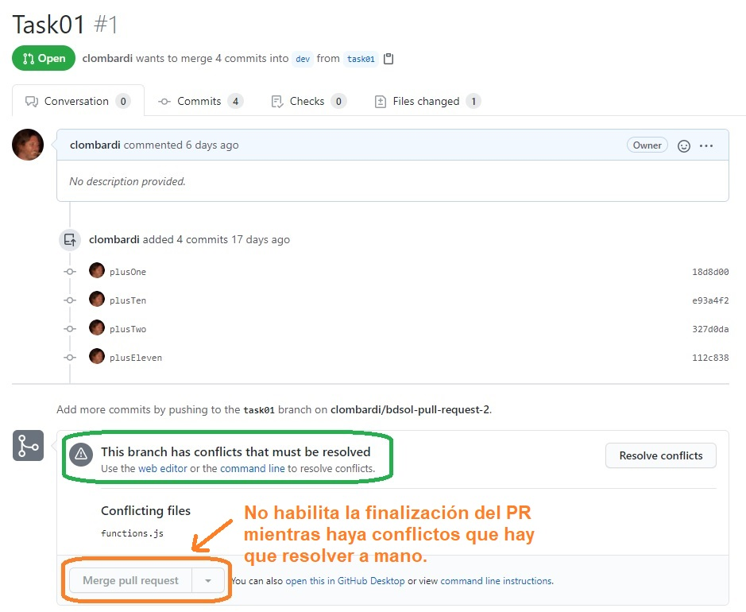
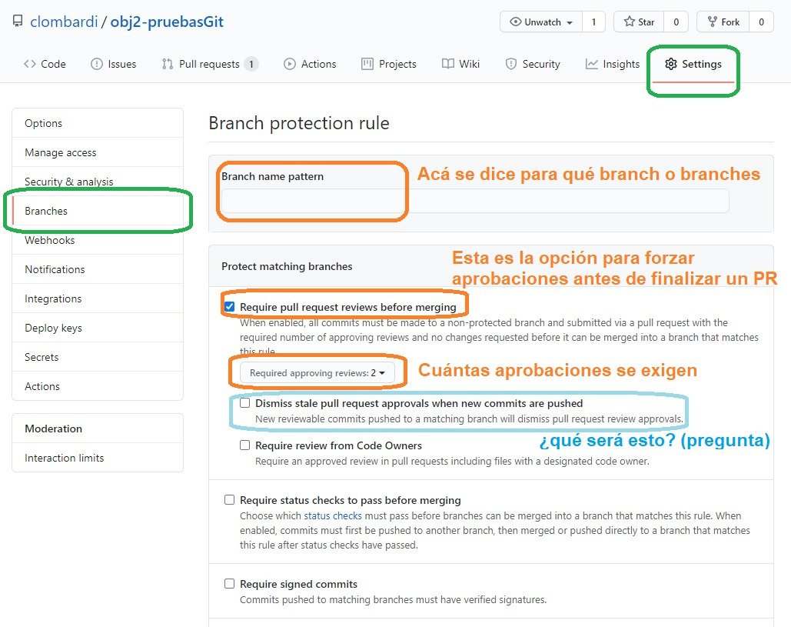
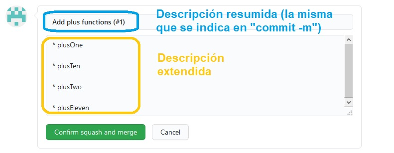

# Pull requests
Hasta ahora, describimos algunas características y comandos de Git con un enfoque _técnico_.
Partimos de la concepción de un repo como una red de commits, estudiamos con algún detalle el efecto de distintos comandos en esa red, y analizamos la relación entre un repo local y su/s remoto/s.  
Al final de la página anterior, empezamos a hablar de _escenarios de uso_, específicamente para pensar en distintos casos, las consecuencias de usar merge o rebase.

En el resto del material sobre Git, vamos a enfocarnos más en el _uso_ de Git en un proyecto. 
En esta página vamos a comentar los pull requests; en la siguiente se va a describir un posible _modelo de branching_ para un proyecto.

## Contexto de los pull requests - integración de código
No es nuevo para ustedes que cada tarea se trabaja (o debería trabajarse) en un branch separado.
Cuano se considera que la tarea está terminada, el código se va integrando (o "promoviendo") a otros branches que consolidan el trabajo de distintas personas o equipos, y/o se deployan en distintos ambientes "intermedios"(de tests automáticos, QA, UAT) hasta llegar al objetivo final, que es el branch que se depliega en ambientes productivos.

Desde un punto de vista técnico, y hablamos bastante sobre cómo implementar una integración de código de un branch de tarea en un branch de integración, utilizando Git. Digamos que queremos integrar los cambios registrados en el branch `task01`, sobre el task `dev`. Una forma posible consiste en la siguiente secuencia de comandos y acciones.
1. `git checkout task01`
1. `git pull`
1. `git checkout dev`
1. `git merge task01`, resolviendo eventualmente los conflictos que requieren resolución manual.
1. `git push <remoto> dev`

Esto lo hace un integrante del equipo del proyecto, que está encargado de las integraciones.
Después de hacer el `pull` de `task01`, puede revisar los cambios, para lo que puede utilizar `git diff` (para los cambios en el código) y `git log` (para ver los commits y sus descripciones), o bien usar herramientas gráficas como p.ej. GitKraken.  
El `git log` (o su equivalente en herramientas gráficas) le permiten saber quién hizo cada commit, para poder hacer consultas sobre el código que está revisando.

## Qué es un pull request - el concepto
Los PR son un concepto agregado al modelo de Git, que _formaliza el proceso de integración_.
Un PR permite visualizar cada evento de integración: le da una interfaz que permite consultar los cambios a integrar, se puede pedir opinión a integrantes del equipo, a partir de lo que se pueden generar intercambios. Se pueden consultar los PR en proceso, los que una determinada persona tiene pendientes de revisión, incluso los ya cerrados.

Un PR representa al proceso descripto antes, en el que una persona se baja un branch con cambios, lo revisa y, o bien lo aprueba y mergea (o rebasea) los cambios sobre el branch de integración, o bien lo rechaza, con lo cual el branch con los cambios "muere ahí".  
Las **únicas** diferencias de un PR son
1. que en lugar de ser un proceso local en el equipo de la persona que integra, queda registrado, y varias personas pueden ver los cambios propuestos y opinar sobre ellos. Incluso, se puede indicar que para aceptar un PR, debe haber una cantidad mínima de revisores que aprueben los cambios.
1. que el merge, o el rebase, se hacen _directamente_ sobre un repositorio remoto; la operación nunca pasa por un repo local. Obviamente que una vez mergeado un PR, se puede hacer `pull` para ver los resultados en un repo local. Si se hace merge para la integración, se va a generar el merge commit en el repo remoto, y mediante el `pull` se copia en el repo local.

El nombre "pull request" se refiere a que las personas encargadas del branch con los cambios, les piden a los responsables de integrar, que se _pulleen_ el branch con cambios, lo miren, y si están de acuerdo, lo mergeen. El pull es el paso 2 del proceso local descripto más arriba.

# Qué es un pull request - en la práctica
Un PR es una indicación de que se quieren integrar los cambios registrados en un _branch origen_, sobre un _branch destino_.  

Los branches origen y destino pueden no estar en un mismo repositorio; esto tiene sentido si el repo origen es un _fork_ del repo destino. 
De esta forma se trabaja en proyectos open source, para que una persona sin permisos de escritura sobre el repo de un proyecto pueda proponer contribuciones: hace un fork del repo en el que sí puede escribir, crea un branch _en el fork_, codea su contribución ahí, y cuando juzga que está "para mirar", lanza un PR de su fork al repo del proyecto.  
Entiendo que en el contexto de una aplicación para una organización, siempre (o casi) los repos origen y destino van a coincidir.

> **Pregunta**  
> En el caso en el que el branch origen está en un fork del repo destino, ¿cómo se haría la integración en un repo local?

El concepto de PR es _accesorio_ a Git, no forma parte de su core. Por eso, no vamos a encontrar comandos de Git asociados a PRs. Cada servidor de Git (GitHub / GitLab / BitBucket) tiene su propia implementación de PR; en particular, en GitLab no se los llama "pull request" sino "merge request" o MR: la idea es que quienes hacen los cambios piden que sean mergeados sobre la rama destino.

Los eventos relacionados con un PR se manejaban exclusivamente mediante la interfaz Web ... hasta la semana pasada (escribo esto el 23/09/2020), en la que GitHub liberó una [CLI](https://cli.github.com/) (command line interface) que permite hacer operaciones sobre PRs desde línea de comandos.  
Los PRs se manejan directamente con los repos remotos, no acceden ni modifican repos locales ... al menos en las interfaces Web, la CLI no la probé.

Un PR muestra los cambios a partir de los comandos de Git que dan información: `git log` para calcular qué commits se agregaron en el branch origen, `git diff` para la diferencia en código.
Por eso da la sensación de que al agregar commits en el branch origen, el PR se "actualiza automáticamente": lo que pasa es que al calcular el diff, se incorporan los commits nuevos.

## Información y eventos asociados a un PR
Al crearse un PR, se puede agregar información de distinto tipo, además de indicar los branches origen y destino. Entre esta información agregada encontramos:
- una _descripción_ en la que se explica de qué se tratan, y/o se dan detalles sobre, los cambios que se está pidiendo integrar.
- una propuesta de _revisores_, miembros del equipo a quienes se pide que revisen los cambios y den su opinión.
- uno o varios _issues_ relacionados con el branch origen, esto si el issue tracker es el del mismo repo, o de un producto asociado (recientemente leí que Atlassian integró BitBucket con Jira a este respecto).
- un _label_ que permite ver rápidamente si es una funcionalidad agregada, una corrección de bug, u otro tipo de cambio.

Ya desde la pantalla de creación de un PR, o sea antes de crearlo, se puede ver el diff entre los branches origen y destino propuestos, y si Git puede hacer el merge automáticamente o se requiere de intervención manual para resolver los conflictos.  

En este último caso, se incluye una interface para resolver los conflictos desde la Web; esto va a generar un merge commit directamente en el repo remoto.  

> **Pregunta**  
> En un caso así, ¿se podrán resolver los conflictos en forma local, cómo se haría?

### Revisión de cambios
Cada revisor puede hacer comentarios, que pueden ser respondidos generándose conversaciones.
De esta forma, los PRs pueden volverse un dispositivo de comunicación dentro de un equipo, que puede ser útil sobre todo si el equipo está formado por gente que no se conoce y que trabaja en distintos lugares.

> **Pequeño comentario**  
> para cuando les toque hacer revisiones: los comentarios soportan Markdown, esto en particular permite incluir código y que lo formatee como código.

Finalmente, cada revisor cierra su análisis indicando su opinión. GitHub da tres opciones: 
- aprobado.
- se solicitan cambios, una forma elegante de decir "así como está, no va".
- se hacen comentarios pero no se decide, una forma elegante de decir "abstención".

En la configuración del repo se puede indicar que para algunos branches, sólo se puedan mergear PRs si tienen una cantidad mínima de aprobaciones; esto está en los settings del repo remoto.  

> **Pregunta**  
> Además de la pregunta en la imagen, entrar a esta parte de los settings. Más abajo hay una opción llamada "Require linear history". ¿Qué querrá decir esto?

## Resolución de un PR, squash de commits
Lo más probable es que llegue el momento en que se decida que los cambios están para integrar. En este punto, se puede finalizar el PR desde la misma interfaz Web.  

Vemos que hay tres opciones: una para mergear, una para rebasear, y otra para hacer un "squash". 
Las dos primeras las hablamos bastante, nos queda el "squash".

Hacer un "squash" de commits significa consolidar los cambios de varios commits en uno solo. Si elegimos esta opción, vemos que la interfaz de GitHub nos permite incluir una descripción extendida para el commit consolidado que va a crear.  

Otra opción al finalizar el PR es que borre el branch origen. 

Y este es el fin de la vida del PR. Igualmente, los PR ya finalizados se pueden consultar desde la interfaz.

### Preguntas finales
¿Cómo se haría una operación de squash de commits a mano?

Si se mergea un PR ¿cómo hago para ver el merge commit en el repo local?

En cualquier caso, si decido no borrar el branch origen ¿en qué estado queda?

Si quiero simular el comportamiento de "rebase and merge", o sea, rebasear los cambios del branch origen sobre el destino, y mover el branch destino _pero no el origen_ ¿cómo se puede hacer?

¿Cómo se hace para indicar una descripción extendida al agregar un commit mediante un `git commit`?

