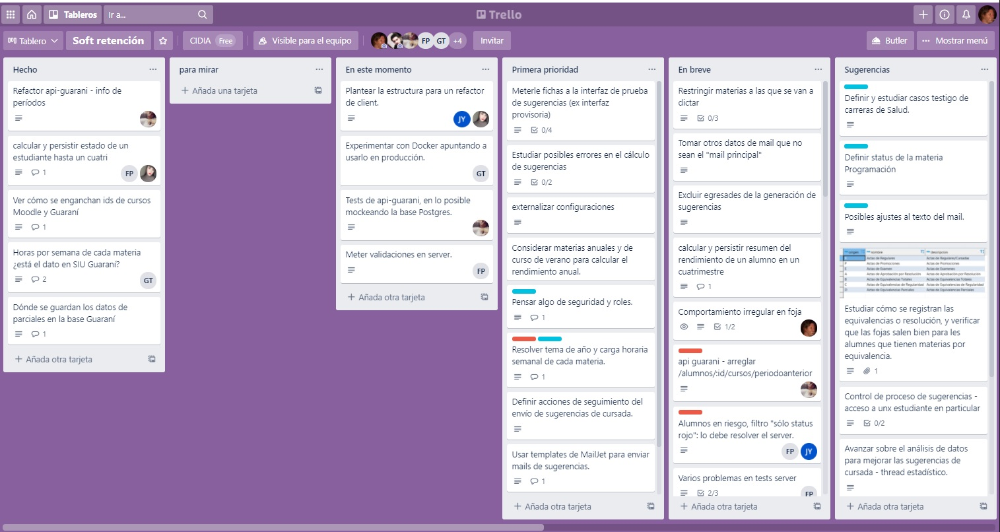

# Recursos

## Repos de base

**Front-end**:  
Es [este](https://github.com/unahur-desapp/react-seed-2024).

**Back-end**:  
- Para JavaScript, es [este](https://github.com/unahur-desapp/nodejs-api-seed). Está preparado para SQL, si se quiere usar Mongo hablar con su docente.
- Para TypeScript, arrancar con el [base de NestJS](https://docs.nestjs.com/first-steps).

## Repos de ejemplo

Para cada ejemplo, qué hacer
1. me lo clono
1. `npm install`
1. `npm start`, para el de Vite `npm run dev`.

¿Y si quiero experimentar y que quede lo que hago en un repo? Pues me hago un fork sobre un usuario u orga de GitHub, al fork lo puedo pushear y compartir.

### De la casa
Por ahora tenemos "cinco y pico".
> _Atención_: los ejemplos de React sobre Create React App no funcionan en versiones modernas de Node, seguro en 14 sí, seguro en 18 no, en 16 no sé.

[Ejemplo de React sobre Vite](https://github.com/unahur-desapp/react-example-vite).  
Incluye: props, estado, rutas, acceso a backend, distintos casos de flexbox, bastante uso de MUI (Stack, tema, Button, Card, herramientas para responsiveness), y Redux.  
Para verlo andando, hay que ejecutar también el nano-backend que se linkea más abajo.

[Ejemplo 1 de React sobre Create React App con varios componentes, props y estado](https://github.com/unahur-desapp/react-ejemplo-1).

[Ejemplo 2 de React sobre Create React App](https://github.com/unahur-desapp/react-ejemplo-2).  
**Está discontinuado**, el que estamos manteniendo es el de Vite que linkeamos arriba.  
Incluye: props, estado, rutas, acceso a backend, distintos casos de flexbox, y bastante uso de MUI.  
Para verlo andando, hay que ejecutar también el nano-backend que se linkea más abajo.

[Ejemplo 1 de Backend usando Express y Postgres/Sequelize](https://github.com/unahur-desapp/backend-ejemplo-1).  
Incluye:
Uso de query params, path params, body y headers / 
Endpoints GET y POST / 
Un endpoint que hace insert en dos tablas.

[Ejemplo de Backend usando Express y MongoDB/Mongoose](https://github.com/unahur-desapp/backend-ejemplo-mongo).  
Tiene: el código necesario para integrar Mongoose y conectarse a una BD Mongo,  algunos ejemplos de queries usando Mongo/Mongoose, y un poco de uso de query params.  
Tiene un GET y un POST.  
Para ver más ejemplos, en particular de uso de distinto tipo de parámetros de request, ver el ejemplo de Postgres/Sequelize.  

> **Atención** - MongoDB con NestJS  
> La forma de conectarse, crear los esquemas y crear los modelos es bastante distinta. Después los queries a partir de un modelo son exactamente iguales.

(este es el "pico")  
[Un nano-backend que define los endpoints que esperan el ejemplo de React-Vite y el ejemplo 2 de React - corre en el puerto 3100 por default](https://github.com/unahur-desapp/react-ejemplo-2-companion-be).

> **Atención**  
> Los repos de ejemplo de React sobre Create React App tienen una base más antigua que el repo de base que linkeamos arriba. Estos repos están para demostrar algunas características de React, Material UI y React Router que no están usadas en el repo de base.  
> 
> Para crear un proyecto nuevo, sugerimos usar como base ... el repo de base, que para eso está.  
> 
> El ejemplo sobre Vite sí usa la misma base que el repo de base que proponemos.

### Otras fuentes
Recuerden que sobre React también pueden ver [el material de la materia Construcción de Interfaces de Usuario](https://unahur.github.io/ciu/#/18-react/1.1-principios).  

Hay varios repos de esa materia que se pueden ver [en este link](https://bitbucket.org/evitalinuxera/workspace/projects/UC).  
**Atenti** - para llegar al link hay que loguearse con un usuario de BitBucket.  
Peeeeero es el mismo usuario del Trello, así que ya tienen .... porque ya se crearon un usuario de Trello, obviamente. Por las dudas, mírense la sección de Trello más abajo en esta misma página.

## Sobre backend
Este material está en una [página aparte](./backend-notas.md).

## Sobre Git
Este material ahora está en una [página aparte](../git/git-index).

## Gestión de proyectos
Esta es la [presentación](../adjuntos/unahur-2022-CS_FINAL.pptx) de Cristian Schiffino, de la que solemos hablar a principio de cada cuatrimestre.

## Documentos

### Fichas de principio y fin de sprint
Al principio y al final de cada script, hay que llenar una pequeña ficha. Van links a documentos de Google Drive. 
Lo más sencillo (creo) es crear una carpeta de Google Drive en la cuenta de une de uds, compartírsela a les otres, e ir metiendo ahí las fichas. Obvio, le/s docente/s tienen que tener permiso de leer y comentar en esa carpeta.

Los siguientes son templates para las fichas. Si se manejan con Google Drive, en cada sprint se pueden hacer una copia, y renombrarla a "Ficha (principio/fin) de sprint (nro-de-sprint)".
-  Template para [principio de sprint](https://docs.google.com/document/d/19Ghm0d92Ur7GU5TC7PJJTEzz6suKjtMgPQkwh62Deg0).  
Este se llena en conjunto con las tareas sobre Trello.  
Este es un [ejemplo](https://docs.google.com/document/d/1fJz5hZ2XOA3LlRKvQTNQqhPwnOXCzLNhA9Z2Qt9QlUU) de ficha de principio de sprint completa.

-  Template para [fin de sprint](https://docs.google.com/document/d/1NAKfgXVUJa0fN4u3FcdQ4xhzzqh4h4ySt8RWc1XBslg).  
Este se llena **antes** del proceso de fin de sprint sobre Trello.  
Este es un [ejemplo](https://docs.google.com/document/d/15Arb3osd64DrW53Whpd3AUPaH4rD7T87se_1IDo95hM/edit?usp=sharing) de ficha de fin de sprint completa.

> **Nota**  
Las tareas que hay que hacer sobre el Trello al principio y al final de cada sprint, se detallan en la [página con detalles del uso sugerido de Trello](./trello).

## Trello
Es el manejador de tareas que recomendamos. Liviano, sencillo, y suficiente para lo que se va a necesitar en la cursada. Online y gratuito.  
Para usarlo hay que obtener una cuenta, ver en https://trello.com/. Con una cuenta gratuita es suficiente.

Un proyecto Trello se organiza en columnas, cada columna puede incluir varias tareas. 
Se ve así

Como se ve en la imagen, cada tarea se le puede asignar a una o varias personas, puede tener etiquetas (que son las marquitas de color rojo o celeste que tienen algunas tareas), y se le pueden adjuntar imágenes u otros archivos (ver la cuarta tarea de la última columna).

Se puede mover una tarea de una lista a otra haciendo simplemente drag-and-drop. Así de fácil.

Después tiene más chiches ... que pueden ir descubriendo ¡y comentando!.

Les dejamos links a algunas páginas del [blog de Trello](https://blog.trello.com/) que pueden ser útiles.
- [How To Use Trello Like A Pro](https://blog.trello.com/how-to-use-trello-like-a-pro).
- [How To Use Trello Like A Pro: Part 2](https://blog.trello.com/using-trello-like-a-pro-part-2).
- [Using Multiple Trello Boards for a Super-Flexible Workflow](https://blog.trello.com/using-multiple-boards-for-a-super-flexible-workflow).  
Acá menciona cómo manejarse con distintos tableros, que es lo que sugerimos a continuación.

### Cómo manejarse con Trello

> Para crear cosas, tienen el botón "+" arriba a la derecha.

Definan **un equipo**, donde estén les integrantes del equipo ... y el/les docente/s. 

Les sugerimos que trabajen con un tablero, definiendo listas separadas para lo que se hizo en cada sprint.

Qué listas incluir en cada tablero, cómo ir moviendo las tareas entre las listas: ver la [página con detalles del uso sugerido de Trello](./trello).

